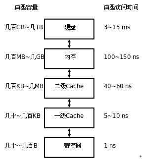
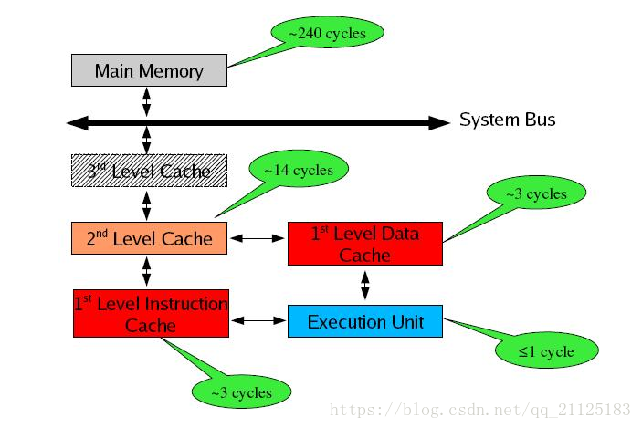
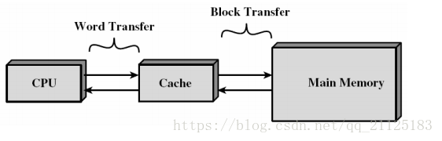
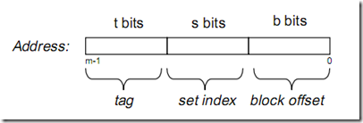
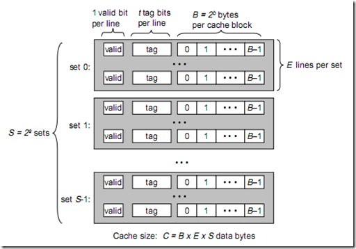
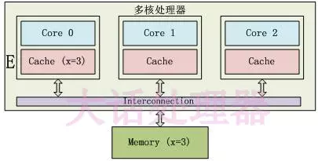
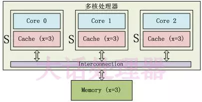
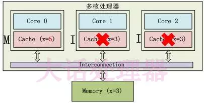
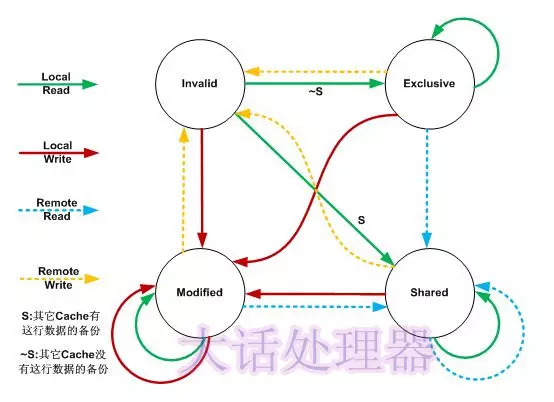

# 计算机缓存Cache以及Cache Line详解

​	转载自https://blog.csdn.net/qq_21125183/article/details/80590934

​	

### 计算机存储体系简介

​	存储器是分层次的，离CPU越近的存储器，速度越快，每字节的 成本越高，同时容量也因此越小。寄存器速度最快，离CPU最近，成本最高，所以个数容量有限，其次是高速缓存（缓存也是分级，有L1，L2等缓存），再次是主存（普通内存），再次是本地硬盘。

​	寄存器的速度最快，可以在一个时钟周期内访问，其次是高速缓存，可以在几个时钟周期内访问，普通内存可以在几十个或几百个时钟周期内访问。

​	存储器分级，利用的是局部性原理。我们可以以经典的阅读书籍为例。我在读的书，捧在手里（寄存器），我最近频繁阅读的书，放在书桌上（缓存），随时取来读。当然书桌上只能放有限几本书。我更多的书在书架上（内存）。如果书架上没有的书，就去图书馆（磁盘）。我要读的书如果手里没有，那么去书桌上找，如果书桌上没有，去书架上找，如果书架上没有去图书馆找。可以对应寄存器没有，则从缓存中取，缓存中没有，则从内存中取到缓存，如果内存中没有，则先从磁盘读入内存，再读入缓存，再读入寄存器。

### 计算机缓存Cache

​	本系列的文章重点介绍缓存Cache。了解如何获取cache的参数，了解缓存的组织结构。

#### cache概述

​	cache，中译名告诉缓冲存储器，其作用是为了更好的利用局部性原理，减少CPU访问主存的次数。简单的说，CPU正在访问的指令和数据，其可能会被以后多次访问到，或者是该指令和数据附近的内存区域，也可能会被多次访问。因此，第一次访问这一块区域时，将其复制到cache中，以后访问该区域的指令或者数据时，就不用再从主存中取出。

​	Cache分成多个组，每个组分成多个行，linesize是cache的基本单位，从主存向cache迁移数据都是按照linesize为替换单位的。比例linesize为32Byte，那么迁移必须一次迁移32Byte到cache。这个linesize比较容易理解，想想我们前面书的例子，我们从书架往书桌搬书必须以书为单位，肯定不能把书撕了以页为单位。书就是linesize。当然了现实生活中每本书的页数不同，但是同个cache的linesize总是相同的。

​	所谓8路相连（8-way set associative）的含义是指，每个组里有8个行。

​	我们知道，cache的容量要远远小于主存，主存和cache肯定不是一一对应的，那么主存中的地址和cache映射关系是怎么样的呢？

​	拿到一个地址，首先映射到一个组里面去。如何映射？取内存地址的中间几位来映射。

​	举例来说，data cache：32-KB，8-way set associative，64-byte line size

​	Cache总大小为32KB，8路相连（每组有8个line），每个line的大小linesize为64Byte。我们可以很轻易的算出一共有32K/8/64=64个组。

​	对于32位的内存地址，每个line有2^6=64Byte，所以地址的[0,5]区分line中的哪个字节。<!--因为从内存中取数据到cache时，是取连续的64Byte，这64个字节的地址肯定是除了低6位不同，其他位都是相同的（类似与内存4K对齐的低12位）-->一共64个组，我们取内存地址中间6位来hash查找地址属于哪个组。即内存地址的[6,11]位来确定属于64组的哪一个组。组确定了之后，[12,31]的内存地址与组中8个line挨个比对，如果[12,31]位与某个line一致，并且这个line为有效，那么缓存命中。

**cache分成三类：**

1. 直接映射高速缓存（direct），这个简单，即每个组只有 一个line，选中组之后不需要和组中的每个line比对，因为只有一个line。
2. 组相联高速缓存（N-Way Set Associative），这个就是我们前面介绍的cache，S个组，每个组E个line。
3. 全相联高速缓存（Fully Associative），只有一个组，就是全相联。不用hash来确定组，直接挨个对比高位地址。

> 为什么Cache不做成Fully Associative？
>
> ​	Fully Associative字面意思是全关联。在CPU Cache中的含义是：如果在一个Cache集内，任何一个内存地址的数据可以被缓存到任何一个Cache Line里，那么我们称这个Cache是Fully Associative。从定义中我们可以得出这样的结论：给一个内存地址，要知道它是否存在于Cache中，需要遍历所有Cache Line并比较缓存内容的内存地址。而Cache的本意就是为了在尽可能少的CPU Cycle内取到数据。那么想要设计一个快速的Fully Associative的Cache几乎是不可能的。
>
> 为什么Cache不做成Direct Mapped？
>
> ​	和Fully Associative完全相反，使用Direct Mapped模式的Cache给定一个地址，就唯一确定了一条Cache Line。设计复杂度低且速度快。让我们来想象这么一种情况：一个拥有1M L2 Cache的32位CPU，每条Cache Line的大小为64Bytes。那么整个L2 Cache被划为1M/64Byte=16384条Cache Line。我们为每条Cache Line从0开始编上号。同事32位CPU所能管理的内存地址范围是2^32=4G，那么Direct Mapped模式下，内存也被划为4G/16384=256K的小份。也就是说每256K的内存地址共享一条Cache Line。
>
> ​	但是，这种模式下每条Cache Line的使用率如果要做到接近100%，就需要操作系统对于内存的分配和访问在地址上也是近乎平均的。而与我们的意愿相反，为了减少内存碎片和实现便捷，操作系统更多的是连续集中的使用内存。这样会出现的情况就是0-1000号这样的低编号的Cache Line由于内存经常被分配并使用，而16000号以上的Cache Line由于内存鲜有进程访问，几乎一直处于空闲状态。这种情况下，本来就宝贵的1M二级CPU缓存，使用率也许50%都无法达到。
>
> N-Way Set Associative的优点：
>
> - 给定一个内存地址可以唯一对应一个set，对于set中只需遍历16个（为什么是16个？？？？）元素就可以确定对象是否在缓存中（Full Associative中比较次数随内存大小线性增加）
>
> - 每2^18(256K)*64=16M的连续热点数据才会导致一个set内的conflict（Direct Mapped中512K的连续热点数据就会出现conflict）（conflict没看懂？？？？？？？？？？待以后继续学习）
>
>   https://blog.csdn.net/midion9/article/details/49487919

### Cache 结构

​	假设内存容量为M，内存地址为m位：那么寻址范围为0000....00~FFFF....F（m位）

​	倘若把内存地址分为以下三个区间：

​			

​	tag，set index，block offset三个区间有什么用呢？再来看看Cache的逻辑结构吧：

​	将此图与上图做对比，可以得出各个参数如下：

​	B = 2^b

​	S = 2^s

​	现在来解释一下各个参数的意义：

​	一个Cache被分为S个组，每个组有E个Cache Line，而每个Cache Line中，有B个存储单元，现在处理器中，这个存储单元一般是以字节（通常是8位）为单位的，也是最小的寻址单元。因此，在一个内存地址中中间的s位决定了该单元被映射到哪一组，而最低的b位决定了该单元在Cache Line中的偏移量。valid通常是一位，代表该Cache Line是否是有效的（当该Cache Line不存在内存映射时，当然是无效的）。tag就是内存地址的高t位，因为可能会有多个内存地址映射到同一个Cache Line中，所以该位是用来校验该Cache Line是否是CPU要访问的内存单元。

​	当tag和valid校验成功时，我们称为Cache命中，这是只要将cache中的单元取出，放入CPU寄存器中即可。

​	当tag或valid校验失败的时候，就说明要访问的内存单元（也可能是连续的一些单元，如int占4个字节，double占8个字节）并不在cache中，这时就需要去内存中取了，这就是cache不命中的情况（cache miss）。当不命中的情况发生时，系统就会从内存中取得该单元，将其装入cache中，与此同时也放入CPU寄存器中，等待 下一步处理。

#### 计算机缓存行Cache Line

​	高速缓存其实就是一组称之为缓存行（Cache line）的固定大小的数据块，其大小是以突发读或者突发写周期的大小为基础的。

​	每个高速缓存行完全是在一个突发操作周期中进行填充或者下载的。即使处理器只存取一个字节的存储器，高速缓存控制器也启动整个存取器访问周期并请求整个数据块。缓存行的第一个字节的地址总是突发周期尺寸的倍数。缓冲行的其实位置总是与突发周期的开头保持一致。

​	当从内存中取单元到cache中时，会一次取一个cache line大小的内存区域到cache中，然后存进相应的cache line中。

​	例如：我们要取地址（t，s，b）内存单元，发生了cache miss，那么系统会取（t, s, 00...000）到（t, s, FF...FFF）（b个0，b个F）的内存单元，将其放入相应的cache line中。

​	下面看看cache的映射机制：

> ​	当E=1时，每组只有一个cache line。那么相隔2^(s+b)个单元的2个单元内存，会被映射到同一个cache line中。（因为cache被占满了，然后从头开始了吗？）
>
> ​	当1<E<C/B时，每组有E个cache line，不同的地址，只要中间s位相同，那么就会被映射到同一组中，同一组中被映射到哪个cache line中是依赖于替换算法的。
>
> ​	当E=C/B，此时S=1，每个内存单元都能映射到任意的cache line。带有这样的cache 处理器几乎没有，因为这种映射机制需要昂贵复杂的硬件来支持。

------

#### 替换策略

​	随机：随机确定需要替换的块

​	先进先出：选择最先调入的块进行替换

​	LRU（最近最少使用）：根据块的使用情况，选择最近最少使用的块进行替换，反应热程序的局部性规律。

#### 写模式

​	直写（Write Through）：透过本级缓存，直接把数据写到下一级缓存（或直接写到内存）中，如果对应的段被缓存了，同时更新缓存中的内容（甚至直接丢弃）

​	缓存中的段永远和它对应的内存内容匹配。

​	写回（Write Back）：缓存不会立即把写操作传递到下一级，而是仅修改本级缓存中的数据，并且把对应的缓存段标记为“脏”段。脏段会触发写回，也就是把里面的内容写到对应的内存或下一级缓存中。回写后，脏段又变“干净”了。当一个脏段被丢弃的时候，总是要先进行一次回写。

​	回写规律：当所有的脏段被回写后，任意级别缓存中的缓存段的内容，等同于它对应的内存中的内容。

​	弱一致性：要么缓存段的内容和内存一致（如果缓存段是干净的话），要么缓存段中的内容最终要回写到内存中（对于脏缓存段来说）

​	优点：能过滤掉对同一地址的反复写操作 ，并且，如果大多数缓存段都在回写模式下工作，那么系统经常可以一下子写一大片内存，而不是分成小块来写，效率更高。

#### 一致性

​	单核是没有问题的，但是多核情况下，每个核都有自己的缓存，该如何确保各个核缓存的数据的一致性？

### 窥探协议

​	所有内存传输都发生在一条共享的总线上，而所有的处理器都能看到这条总线：缓存本身是独立的，但是内存资源是共享的，所有的内存访问都要经过仲裁（arbitrate）：同一个指令周期中，只有一个缓存可以进行读写内存。

​	缓存不仅仅在做内存传输的时候才和总线打交道，而是不停地窥探总线上发生的数据交换，跟踪其他缓存在做什么。所以当一个缓存代表它所属的处理器去读写内存时，其他处理器都会得到通知，它们以此来使自己的缓存保持同步。只要某个处理器一写内存，其他处理器马上就知道这块内存在它们自己的缓存中对应的段已经失效。

​	在直写模式下，是很直接的，因为写操作一旦发生，它的效果马上就会被“公布”出去，确保所有的核都得到通知。

​	在回写模式下，就有问题了，因为有可能在写指令执行过后很久，数据才被真正回写到物理内存。这段时间内，其他处理器的缓存也可能会去写同一块内存地址，导致冲突。

### MESI缓存一致性协议

​	每个Cache Line有两个标志：dirty（数据是否被修改）和valid（数据是否有效）标志，描述了Cache和主存之间的数据关系。

​	在MESI协议中，每个Cache Line有4个状态

| 状态           | 描述                                                         |
| -------------- | ------------------------------------------------------------ |
| M（Modified）  | 数据有效，数据被修改了，和内存中的数据不一致，数据只存在于本Cache中 |
| E（Exclusive） | 数据有效，数据和内存中的数据一致，数据只存在于本Cache中      |
| S（Shared）    | 数据有效，数据和内存中的数据一致，数据存在于很多Cache中      |
| I（Invalid）   | 运行数据无效                                                 |

​	M（Modified）和E（Exclusive）状态的Cache Line，数据是独有的，不同点在于M状态的数据是dirty的（和内存的不一致），E状态的数据是clean的（和内存一致）

​	S（Shared）状态的Cache Line，数据和其他Core的Cache共享。只有clean的数据才能被多个Cache共享。

E状态

​	只有Core 0访问变量x，它的Cache line状态为E（Exclusive）

S状态

​	3个Core都访问变量x，它们对应的Cache Line为S（Shared）状态

M状态和I状态

​	Core 0修改了x值之后，这个Cache Line变成了M（Modified）状态，其他Core对应的Cache Line变成了I（Invalid）状态

#### MESI协议状态迁移

​	Local Read表示本内核读本Cache中的值，Local Write表示本内核写本Cache中的值，Remote Read表示其他内核读取其它Cache中的值，Remote Write表示其他内核写其他Cache中的值，箭头代表本Cache Line状态的迁移，环形箭头表示状态不变。

| 当前状态       | 事件         | 行为                                                         | 下一个状态 |
| -------------- | ------------ | ------------------------------------------------------------ | ---------- |
| I（Invalid）   | Local Read   | 如果其他Cache没有这份数据，本Cache从内存中取数据，Cache Line状态变成E；如果其他Cache有这份数据，且状态为M，则将数据更新到内存，本Cache再从内存中取数据，两个Cache的Cache Line状态都变成S；如果其他Cache中有这份数据，且状态为S或者E，本Cache从内存中读取数据，这些Cache的Cache Line状态都变成S。 | E/S        |
| I（Invalid）   | Locate Write | 从内存中取数据，在Cache中修改，状态变成M；如果其他Cache有这份数据且状态为M，则要先将数据更新到内存；如果其他Cache有这份数据，则其他Cache的Cache Line状态变为I。 | M          |
| I（Invalid）   | Remote Read  | 既然是Invalid，别的核的操作与它无关。                        | I          |
| I（Invalid）   | Remote Write | 既然是Invalid，别的核的操作与它无关。                        | I          |
| E（Exclusive） | Local Read   | 从Cache中取数据，状态不变                                    | E          |
| E（Exclusive） | Local Write  | 修改Cache中的数据，状态变成M                                 | M          |
| E（Exclusive） | Remote Read  | 数据和其他核公用，状态变为S                                  | S          |
| E（Exclusive） | Remote Write | 数据别修改，本Cache Line不能再被使用，状态变为I              | I          |
| S（Shared）    | Local Read   | 从Cache中读取数据，状态不变                                  | S          |
| S（Shared）    | Local Write  | 修改Cache中数据，状态变成M，其他核共享的Cache Line变成I      | M          |
| S（Shared）    | Remote Read  | 状态不变                                                     | S          |
| S（Shared）    | Remote Write | 数据被修改，本Cache Line不能在被使用，状态变成I              | I          |
| M（Modified）  | Local Read   | 从Cache中去数据，状态不变                                    | M          |
| M（Modified）  | Local Write  | 修改Cache中的数据，状态不变                                  | M          |
| M（Modified）  | Remote Read  | 这行数据被写到内存中，使其他核能使用到最新的数据，状态变成S  | S          |
| M（Modified）  | Remote Write | 这行数据被写到内存中，使其他核能使用到最新的数据，由于其他核会修改这行数据，状态变成I | I          |

**MESI定律**：在所有的脏缓存段（M状态）被回写后，任意缓存级别的所有缓存段中的内容，和它们对应的内存中的内容一致。此外，在任意时刻，当某个位置的内存被一个处理器加载入独占缓存段时（E状态），那它就不会再出现在其他任何处理器的缓存中。

