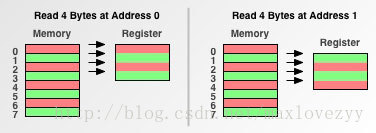
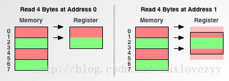
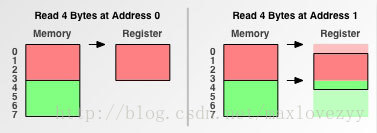
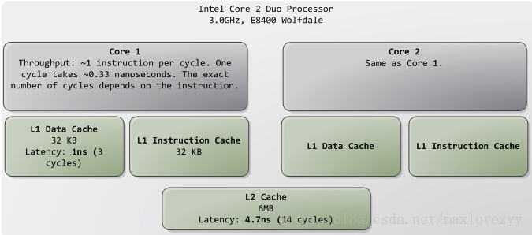
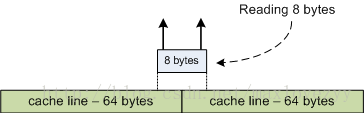
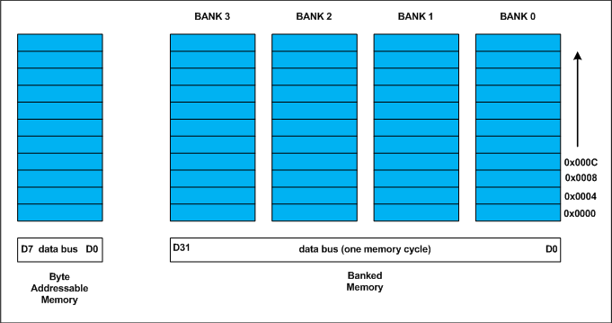
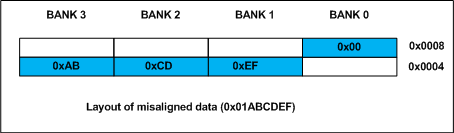

## Data Alignment

​	**个人理解**

​	说内存对齐之前，先说说硬盘对数据的组织方式。我们知道，文件系统管理数据是按照块来管理的，假如说一个4k对齐的文件系统，一个inode节点对应一个4k大小的块，当你写入一个size为1k的文件的时候，这个文件会得到一个inode，对应的写入其4k块中，之后这个块不会存储其他文件的内容了，新的文件会有新的inode。所以对于一个4k大小格式化的文件系统，如果在其上存储的所有文件都是1K这么大，那么硬盘会极大地浪费存储空间，每个4k块都仅仅存储了1K的数据，剩余3k都闲置了。ext4默认是4k一个块，对应8个硬盘扇区。为了简化讨论，我们以文件系统的1块对应硬盘一个扇区的系统来讨论。假如我们写入1byte，那么事实上硬盘的写入了这个1byte也会占用写入的那个扇区，这个扇区不会再写入其他数据了，闲置了511bytes的空间。那么我们不禁会问，我们为什么要这么做？为什么会有扇区这个概念？多浪费空间啊！硬盘创始之初为什么要这么设计呢？ 
　　我的猜想是这样：假设硬盘的盘片容量是100万bytes，那么一个机械硬盘一个探头，按照1byte的元数据粒度定位一个位置，是得有多么的慢。。。假如我们按照sector划分，按照512的粒度去定位，是不是就快了很多？尽管对于小于512bytes的文件会有空间浪费，但是这些浪费是很值得的，极大地提高了定位速度。本来cpu就快，内存也很快，IO如果以1byte的粒度定位，那程序没法做IO了。另外，我们一个通用文件系统不可能都存储这么小的文件。对于超过512bytes的文件来说，最多浪费了占用的最后一个扇区的部分空间而已。进而我们可以想象为什么ext4会设计成默认4k一个逻辑块对应了8个扇区了，都是为了定位速度，当然也有元数据方面的考虑，但是都是为了速度。 	

​	通过上面的猜想，我们推想操作系统对内存的组织方式。我们都知道内存是按照页来管理的，为什么要这样？就是为了定位速度(当然此时也是有元数据量的考虑)，要知道内存远比cpu慢。

#### **内存对齐**

​	程序员眼中的内存：

​		

​	cpu眼中的内存：

​		

这里我懒了，盗用上述链接的图，对于64位的机器，一般cpu取存储内存数据的粒度是64bits除以8为8bytes。咱们以64位的讨论。也就是说cpu取一次数据不是1byte，而是8bytes，它不会忙活一次就拿那么点，而是能拿多少拿多少，免得跑那么多次。另一个侧面看的话，也会提升访问效率。 
　　现在又有一个问题了，那就是cpu它从什么位置开始取？随便吗？想想上面讨论的sector的来历，如果cpu一个byte一个byte的计算位置，慢不慢？事实上cpu的寻找方式是8个bytes 8个bytes的找，这下计算到哪找快多了吧？读/写总是从cpu数据访问粒度的倍数的地址开始的：0、8、16等等(通过wikipedia的Data Structure Alignment词条以及多篇中英文文章的阅读推断出来的，想深究的可以深究下告诉我）。 

　　有了上面的基础去讨论内存对齐对性能的影响还不够，还需要了解什么是内存对齐。

​	<!-- 内存对齐：基本类型的内存起始地址是其大小的整数倍；复合类型的内存地址是其最大成员的大小的整数倍（对于复合类型如struct的内存padding自动调整到按照最大成员来补齐以方便复合类型内存对齐的知识比较简单，这里就不介绍了。要注意这叫做内存补齐，是为了内存对齐做的）。-->

​	那么现在就来看看内存对不对齐对cpu访问的性能有什么影响（基于cpu对内存的访问）。 

- [ ] case1 内存访问粒度为1个字节（cpu眼中的内存模型等价于程序员眼中的内存模型）： 

​				

​	Result：读取4个字节，两者都需要进行4次内存访问操作。在粒度1的情况下不需要考虑内存对齐。 

- [ ] case2 内存访问粒度为2个字节：

​				

​	Result：读取4个字节，左边的（内存对齐地址）只需要进行2次内存访问操作，右边的需要进行3次内存访问操作+附加操作（见下文）。内存对齐地址取胜！ 

- [ ] case3 内存访问粒度为4个字节： 

​			

​	Result：读取4个字节，左边的只需要进行1次内存访问操作，右边的需要进行2次内存访问操作+附加操作。内存对齐地址再次取胜！

**简单讨论：** 
　　内存对齐地址vs没有内存对齐的地址，在三种不同的内存访问粒度下，取得了2胜一平的完胜战绩。对于32位的机器，实际的内存访问粒度是4个字节，原因如下： 
​	每一次内存访问操作需要一个常量开销； 
​	在数据量一定的情况下，减少内存访问操作，能提高程序运行性能； 
​	增大内存访问粒度（当然不超过数据总线的带宽），能减少内存访问操作（从上面的实例就能够看出来）； 
​	一句话，内存对齐确实可以提高程序性能。

　*cpu如何处理没有内存对齐的数据访问？* 
1. 读取数据所在的第一块内存空间（0-1），移除多余字节（0） 
2.  读取数据所在的第二块内存空间（2-3） 
3. 读取数据所在的第三块内存空间（4-5），移除多余字节（5） 
4. 把三块数据拼接起来（1-4），放入寄存器中。

　　如果cpu能这么来处理，也只不过是影响了我们程序的运行性能，至少还是能运行的，但有的cpu并没这么“勤快”，遇到没有内存对齐的数据访问，它会直接抛出一个异常。操作系统可能会响应这个异常，用软件的方式来处理，性能只会更差，或者程序直接崩溃掉。 内存对齐的代码具有更高的可移植性。​	

**CPU Cache**

​	看完上述内容，是不是觉得写代码一定要注意内存对齐啊，好处多多。但是很遗憾，需要了解的知识还有很多，先从cache入手。 

　　现代cpu都是有cache(如下图)系统的，cpu访问数据并不是直接访问内存中的数据，而是先访问cache，如先L1 cache，后L2,L3 cache，都不命中才会访问内存。那么问题来了，cache究竟是怎么组织的？ 

​		

​	我们抛开L2、L3，讨论他们会使问题复杂化，我们只考虑L1 cache就能理解问题了，下面只说L1 cache。 
　　可以通过dmidecode命令找到Cache Infomation项或者lstopo命令看到cache信息。现在问题又来了，这么大个cache空间，是组织在一起的？当然不是，这“耦合度”多高。这里有一个cache line的概念，是缓存管理的最基本单元，cache line的大小可以通过命令cat /proc/cpuinfo来查看，其中的cache_alignment就是cache line的大小，单位是byte。拿cache line为64来说，如果L1 cache是32k，那么每个core就会拥有32 * 1024 / 64这么多个cache line可以cache数据/指令。cpu读取内存数据的时候有个特性，如果没有，那就是每次即便你只读取1byte，它也会从内存的cache line对齐的位置的第一个包含了数据部的位置开始加载一个cache line这么多的数据到一个cache line之中。下次如果cache失效之前还用数据，就从cache里找包含要访问的数据的cache line，直接拿来用(当然这里包含cache一致性的问题，后面会简单说下)。那么问题来了，访问cache line有没有上面说的对齐的问题？也有，但是以cache的速度来说，你很难感知到，可以理解为没差别。如下图。 

​			　

​	现在我们应该对cpu如何从无cache的情况访问数据有一个认识了：

> 1. 以cache line(64的倍数的地址作为起始地址)对齐的方式访问内存，加载一个cache line大小的数据(如果不是cache line对齐，可能加载2个cache line)
> 2. 以cpu粒度对齐访问cache line取得数据(如果不是cache line对齐并且大小可以被cache line整除，可能跨2个cache line)

**内存对齐对性能的影响**
​	现在是时候完整的算上cache来讨论内存对齐对性能的影响了。

> 1. 对于第一步从内存加载数据到cache的过程，由于内存加载数据到cache是以cache line对齐的方式，时间性能其实都用在了cache line的加载上。问题是如果你的结构跨了cache line，那么加载它就会加载俩cache line。
> 2. 对于第二步从cache line到cpu寄存器的过程，我这里认为对不对齐对时间性能的影响可以忽略不计。因为L1 cache实在是太快了，你会无感觉的。
> 3. 对于原子操作，不对齐的话非常伤性能。大步长的循环不对齐非常伤性能。
> 4. 可以预见多线程编程的话，一边读一边写什么的，不对齐可能会非常伤性能。因为cache一致性机制就需要保证核间cache包括主存的一致性了。

　　按照上述，那也就是说数据对不对齐除了某些场景下性能影响较大，其他也无所谓了？也不是，类似于英特尔的SSE指令对内存对齐有着严格的要求，类似于某些指令架构不支持非对齐访问，类似于有的架构的原子操作要求必须对齐等。

　　你可能注意到上面谈到的都是读，写的话大同小异，我只想了解该不该对齐，有没有用，不想研究那么细致。

**cache一致性问题**
　　cpu的每一个core都有自己的L1 cache，cache之间怎么协同的？并发编程时这非常重要。通过学习，我从语义上总结如下(也经过了实测)：

> 1. 对于读，每个核心都有自己的cache，如果cache有，编译器会优化(不一定非得循环才优化)读cache而忘记内存，除非你加上了内存屏障或有内存屏障作用的指令，比如互斥量，原子操作，慢系统调用等等。
>
> 2. 对于写，先会写到cache，在强保证顺序一致性的内存模型架构中你可以认为语义上它写到了内存，但现实是即便像x86这样的强内存模型的架构也不是语义上百分百保证cache一致性的，所以一个线程写，另一个线程想感知到，必须通过具有内存屏障作用的指令(比如lock、memory barrier、atomic operation等)来保证。

　　对于缓存一致性的原理讲解，当时了解了上述语义就没去记忆细节。有兴趣的看参考链接或自行google [cache coherence]。这里可能会疑惑为什么要在说内存对齐对性能的影响的时候提cache一致性，因为理解原子操作的语义时需要用到。

**原子操作**
​	原子操作是时候登场了。原子操作是什么就不介绍了，自行搜索。我只想说说我理解到的语义上的原子操作和总线锁有什么区别。

> 1. 总线锁：　顾名思义，会锁住总线，其他核心只能等待，自行体味性能。
>
> 2. 原子操作：只锁住所在的cache line，写的时候不一定就写到内存，至于一致性，通过cache coherence保证，自行体味性能。另外，如果对跨cache line的数据做原子操作，有的架构可能不支持，有的架构可能会退化成总线锁，其他即便不退化为总线锁，性能也会很差。

　　这里可能会疑惑为什么要在说内存对齐对性能的影响的时候提原子操作，因为我的例子中会用到，为了方便解释例子，这里必须说下原子操作。

**怎么做比较好**
​	综上述讨论，我认为这么做比较好：

> 1. 结构设计的时候一定要考虑cache line的整除性。也就是说一个结构体，大小尽可能被cache line整除，可以通过添加padding很容易做到，这不是编译器能做到的。这样做的好处的显而易见，多个相同结构连续上后不会出现夸cache line的时候，提高了效率；cache line边界的它的某个对象失效时也不会一下子失效俩cache line。这叫做cache友好，这也是内存布局性能优化最最重要的地方，据说内核代码随处可见。另外，也不会出现一个cache line内有两个不相关的数据，一个失效了不会导致另一个也随着cache line的失效而失效。
> 2. 相关联的数据尽量放到一个cache line中。这样的话加载一个数据的时候，另一个就随着cache line的加载被动的加载进来了。
> 3. 内存池上分配时要按照cache line大小的倍数来对齐，nginx就是这么做。
> 4. 内存池上的对象分配时要按照至少cpu粒度大小的倍数对齐，最好是64位机器按16bytes对齐，nginx就是这么做，另外malloc默认就是。

对于第1点，给个例子如下：

```
struct Test {
   char ch1;
   int  i1;
   ...
   char padding[16]; /*纯粹为了凑凑使得Test大小等于cache line*/
}
```

　　另外，其实malloc等等各种系统内存分配api得到的内存空间的首地址都会是cpu粒度对齐的，一般情况下你不需要操心。据我所知，32位系统malloc按8对齐，64位按16对齐。如果你有特殊需求需要自定义对齐，可以通过posix_memalign这个posix标准的api自定义。比如你要按照cache line对齐时，比如你要使用SSE等特殊场景需要特殊对齐时，比如你要按照内存也4k对齐时等等。

##### 来自：https://blog.csdn.net/maxlovezyy/article/details/70231804


​	C语言，在对一个 struct variable使用sizeof operator(操作符)的时候，往往得到的结果并不是我们想象中——struct内所有member的size之和。 

​	当清楚了什么是Data alignment(数据对齐)，对这个问题就豁然开朗了。 

​	Data Alignment 并非针对 Data 本身，而是Data(Variable)的内存地址 。在 MSDN 对Alignment做出定义，其第一句话便是 

​	Alignment is a property of a memory address。（数据对齐是内存地址的一个特性。） 

以一张表格来展现32-bit machine 的内存结构 



​	计算机中，内存是由大量的，连续的，可寻址的或编了号的memory cells(内存单元)构成。每个memory cell 占1 byte。 

​	假如上述表格 bank0的address 为X，那么bank1,bank2,bank2的地址分别为X+1,X+2,X+2。 

​	CPU在处理内存数据时，并非一次提取一个memory cell，一般提取一组相邻内存单元。在32-bit machine,CPU一次从内存中读取 4个连续的memory cell(4-byte) 。所以在此表格中，4 byte chunk(4字节流) 为一个读取周期。在读取一个int型 数据时，仅仅需要一个周期(int 占4 byte)。读取Double型，则需要2个读取周期。表格(D0-D31，32-bit)表示一个内存周期。如果是8-bit machine 即1字长(D0-D7),则需要4个周期来读取一个integer。 

​	说了一些基本的内存知识，接下来看看 MSDN对Alignment的定义是怎么样的 

​	MSDN 写道

> Alignment is a property of a memory address, expressed as the numeric address modulo a power of 2. For example, the address 0x0001103F modulo 4 is 3; that address is said to be aligned to 4n+3, where 4 indicates the chosen power of 2. The alignment of an address depends on the chosen power of two. The same address modulo 8 is 7. 
>
> An address is said to be aligned to X if its alignment is Xn+0. 
>
> CPUs execute instructions that operate on data stored in memory, and the data are identified by their addresses in memory. 

​	仔细理解下，可以总结为，当向内存中放入一个数据(variable)时，此数据的地址，严格来说是offset，起始地址，必须是此数据的Alignment的整数倍。即上述 Xn+0。 

对于每种类型的数据，都有其自身的Alignment 

| Data Type | Alignments(in Bytes) |
| --------- | -------------------- |
| char      | 1                    |
| short     | 2                    |
| int       | 4                    |
| float     | 4                    |
| double    | 4 or 8               |

​	例如char 的offset可以在bank0,bank1,bank2,bank3任意一个(这里为了方便，假设bank0初始位置的address为0，依次类推)。short型的2 bytes只能存储在 bank0-bank1或者bank2-bank3，假如其offset在bank1上，即存储在bank1-bank2，那么此address为奇数，并非short alinment的整数倍。 

​	int型，offset只能在bank0上，在其他位置，都不会是4的整数倍。如果一个int型的整数,0xABCDEF,在内存中的起始位置在 bank1 上会发生什么呢? 



 

​	可以看到此integer的addres并非是4的整数倍，跨过两行，那么在读取此data时，就需要两个读取周期了。 

​	所以data alignment正是用来处理variable在这些bank中的存储方式。

​	以避免发生此情况。在上表中，此整数的地址为5，5=4n+1，按照MSDN定义来说，此整数的alignment为1.但是int 型的alignment应该是4。所以这种情况又称为misaligned。 

**Data Structure Padding**

​	在C/C++中，因为对variable都有alignment的要求，所以在struct中，每一个member都要遵循alignment的要求。就拿 MSDN中的一个例子，来谈下struct的alignment 


```c
struct x_  

{  
   char a;     // 1 byte  
   int b;      // 4 bytes  
   short c;    // 2 bytes  
   char d;     // 1 byte  
} MyStruct;
```

​	同上述表格一样，struct中的member在内存中，是由下至上allocate的。 

​	char a的起始位置在bank0，假如addrees为0; 

​	int b,是不可以在bank1,bank2,bank3，这样b的offset为奇数，不是4的整数倍，所以只能在bank4,其4 bytes在 bank4-bank5-bank6-bank7; 

​	那么在char a与int b之间需要填补3个无意义的byte。来满足int b的对齐方式。 

​	short c是可以在bank8的，8为2的整数倍。所以b,c间无需要填补。那么short c 存储在 bank8-bank9。 

​	char d可以存储在任何位置。那么char d 则存储在 byte10. 

最后需填补1 byte 

| padding byte | char d       | short c      | short c |
| ------------ | ------------ | ------------ | ------- |
| int b        | int  b       | int   b      | int   b |
| padding byte | padding byte | padding byte | char  a |

​	在最后填补一个byte的原因是： 

​	在struct的member的alignment中，找到alignment的最大值(此处为4 bytes),在struct的最后一个member填补 padding bytes使整个struct的size 为此aligment(4 bytes)的整数倍。 

​	所以上述struct 在内存中的实际形式为 

```
// Shows the actual memory layout  
struct x_  
{  
   char a;            // 1 byte  
   char _pad0[3];     // padding to put 'b' on 4-byte boundary  
   int b;            // 4 bytes  
   short c;          // 2 bytes  
   char d;           // 1 byte  
   char _pad1[1];    // padding to make sizeof(x_) multiple of 4  
}  
```

​	此struct的size为12 bytes，而不是8 bytes。 


实例：

​	struct A{

​		char a;			// 1 byte

​		int b;			// 4 byte

​		short c;			// 2 byte

​		char d;			// 1 byte

​	}

​	<!-- 变量a与b之间会有3byte的空位，为了使整个结构体4byte对齐，d之后也有 -->

​	struct B{

​		char a;			// 1 byte

​		char d;			// 1 byte

​		short c;			// 2 byte

​		int b;			// 4 byte

​	}

​	sizeof(struct A) = 12

​	sizeof(struct B) = 8