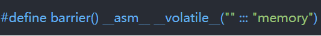
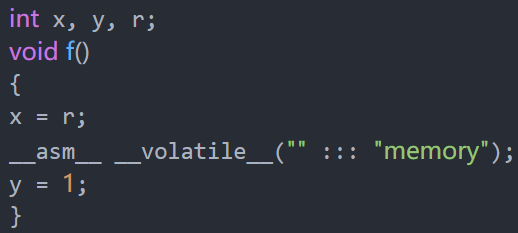

### Memory Barrier（内存屏障）

https://blog.csdn.net/caoshangpa/article/details/78853919

#### 内存乱序访问

​	由于每个CPU都有自己的Cache，内存读写不再一定需要真正的作内存访问，而是直接从Cache里面操作，同时CPU可能会在合适的时候对于内存访问进行重新排序以提高效率，在只有一个CPU的时候，这很完美。而当有多个CPU的时候，从Cache到内存的flush操作通常是被延迟的，所以就需要某种方法保证CPU A进行的内存写操作真的可以被CPU B读取到。

​	程序在运行时内存实际的访问顺序和代码编写的访问顺序不一定一致，这就是内存乱序访问。内存乱序访问行为出现的理由就是为了提升程序运行时的性能。内存乱序访问主要发生在两个阶段：

> 1. 编译时，编译器优化导致内存乱序访问（指令重排）
> 2. 运行时，多CPU间交互引起内存乱序访问
>

#### Memory Barrier

​	Memory Barrier能够让CPU或编译器在内存访问上有序。一个Memory Barrier之前的内存访问操作必定先于其之后的完成。Memory Barrier包括两类：

1. 编译器Memory Barrier
2. CPU Memory Barrier

​	很多时候，编译器和CPU引起内存乱序访问不会带来什么问题，但一些特殊情况下，程序逻辑的正确性依赖于内存访问顺序，这时候内存乱序访问会带来逻辑上的错误。例如：

```c
// thread 1
while (!0k);
do(x);

// thread 2
x = 42;
ok = 1;
```

​	此段代码中，ok初始化为0，线程1等待ok被设置为1后执行do函数。假如说，线程2对内存的写操作乱序执行，也就是x赋值后与ok赋值完成，那么do函数接收的实参就很可能出乎程序员的意料，不为42。

##### ​编译时内存乱序访问

​	在编译时，编译器对代码做出优化时可能改变实际执行指令的顺序（例如gcc下的O2或O3都会改变实际执行指令的顺序）：

```c
// test.c
int x, y, r;
void f(){
	x = r;
	y = 1;
}
```

​	编译器优化的结果可能导致y=1在x=r之前执行完成。首先直接编译此源文件：

​	gcc -S test.c

​	得到相关的汇编代码如下：

```asm
	movl r(%rip), %eax
	movl %eax, x(%rip)
	movl $1, y(%rip)	
```

​	这里我们看到，x=r和y=1并没有乱序。现在使用优化选项O2（或O3）编译上面的代码（gcc -O2 -S test.c），生成汇编代码如下：

```asm
	movl r(%rip), %eax
	movl $1, y(%rip)
	movl %eax, x(%rip)
```

​	我们可以清楚的看到经过编译器优化之后，movl $1,y(%rip)先于movl %eax,x(%rip)执行，避免编译时乱序访问的方法就是使用编译器barrier（又叫优化barrier）。Linux内核提供函数barrier()用于让编译器保证其之前的内存访问先于其之后的完成。内核实现barrier()如下（x86_64架构）：



​	现在把此编译器barrier加入代码中：

​				

​	这样就避免了编译器优化带来的内存乱序访问的问题。本例中，我们还可以使用volatile这个关键字来避免编译时内存乱序访问（而无法避免后面要说的运行时内存乱序访问）。volatile关键字能让相关的变量之间在内存访问上避免乱序，这里可以修改x和y的定义来解决问题：

```c
volatile int x, y;
int r;
void f() {
	x = r;
	y = 1;
}
```

​	现在加上volatile关键字，这使得x相对于y、y相对于x在内存访问上有序。在Linux内核中，提供了一个宏ACCESS_ONCE来避免编译器对于连续的ACCESS_ONCE实例进行指令重排。其实ACCESS_ONCE实现代码如下：

```c
#define ACCESS_ONCE(x) (*(volatile typeof(x)*)&(x))
```

​	此代码只是将x转换为volatile的而已。现在我们就有了第三个修改方案：

```c
int x, y, r;
void f(){ 
	ACCESS_ONCE(x) = r;
	ACCESS_ONCE(y) = 1;
}
```

#### 运行时内存乱序访问

​	在运行时，CPU虽然会乱序执行指令，但是在单个CPU上，硬件能够保证程序执行时所有的内存访问操作看起来像是按照程序代码编写的顺序执行，这时Memory Barrier没有必要使用（不考虑编译器优化的情况下）。这里我们了解一下CPU乱序执行的行为。在乱序执行时，一个处理器真正执行指令的顺序由可用的输入数据决定，而非程序员编写的顺序。

​	早期的处理器为有序处理器（In-order processors），有序处理器处理指令通常有以下几步：

> 1. 指令获取
> 2. 如果指令的输入操作对象（input operands）可用（例如已经在寄存器中了），则将此指令分发到适当的功能单元中。如果一个或多个操作对象不可用（通常是由于需要从内存中获取），则处理器会等待直到它们可用。
> 3. 指令被适当的功能单元执行。
> 4. 功能单元将结果写回到寄存器堆（Register file，一个CPU中的一组寄存器）

​	相比之下，乱序处理器（Out-of-order processors）处理指令通常有以下几步：

> 1. 指令获取
> 2. 指令被分发到指令队列
> 3. 指令在指令队列中等待，直到输入操作对象可用（一旦输入操作对象可用，指令就可以离开队列，即便更早的指令未被执行）
> 4. 指令被分配到适当的功能单元并执行
> 5. 执行结果被放入队列（而不是立即写入寄存器堆）
> 6. 只有所有更早请求执行的指令的执行结果被写入寄存器堆后，指令执行的结果才被写入寄存器堆（执行结果重排，让执行看起来是有序的）

​	从上面的执行过程可以看出，乱序执行相比有序执行能够避免等待不可用的操作对象（有序执行的第二步）从而提高了效率。现代的机器上，处理器运行的速度比内存快很多，有序处理器花在等待可用数据的时间里已经可以处理大量指令了。

​	现在思考一下乱序处理器处理指令的过程，我们能得到几个结论：

> 1. 对于单个CPU指令获取是有序的（通过队列实现）
> 2. 对于单个CPU指令执行结果也是有序返回寄存器堆的（通过队列实现）

​	由此可知，在单个CPU上，不考虑编译器优化导致乱序的前提下，多线程执行不存在内存乱序访问的问题。我们从内核源码也可以得到类似的结论（代码不完全摘录）：​

```c
#ifdef CONFIG_SMP
#define smp_mb() mb()
#else
#define smp_mb() barrier()
#endif
```

​	这里可以看到，如果是SMP则使用mb，mb被定义为CPU Memory barrier，而非SMP时，直接使用编译器barrier。

​	在多CPU的机器上，问题又不一样了。每个CPU都存在cache（cache主要是为了弥补CPU和内存之间较慢的访问速度），当一个特定数据第一次被特定一个CPU获取时，此数据显然不在CPU的cache中（这就是cache miss）。此cache miss意味着CPU需要从内存中获取数据（这个过程需要CPU等待数百个周期），此数据将被加载到CPU的cache中，这样后续就能直接从cache上快速访问。当某个CPU进行写操作时，它必须保证其他CPU已经将数据从它们的cache中移除（以便保证一致性），只有在移除操作完成后此CPU才能安全的修改数据。显然，存在多个cache时，我们必须通过一个cache一致性协议来避免数据不一致的问题，而这个通讯的过程就可能导致乱序访问的出现，也就是这里说的运行时的内存乱序访问。

```c
// cpu_barrier.c
#define _GUN_SOURCE
#include <pthread.h>
#include <assert.h>

// -------------------
int cpu_thread1 = 0;
int cpu_thread2 = 1;

volatile int x, y, r1, r2;

void start()
{
	x = y = r1 = r2 = 0;
}

void end()
{
	assert(!(r1 == 0 && r2 == 0));
}

void run1()
{
	x = 1;
	r1 = y;
}

void run2()
{
	y = 1;
	r2 = x;
}

// -------------------
static pthread_barrier_t barrier_start;
static pthread_barrier_t barrier_end;

static void* thread1(void* arg)
{
	while (1) {
		pthread_barrier_wait(&barrier_start);
		run1();
		pthread_barrier_wait(&barrier_end);
	}
	return NULL;
}

static void* thread2(void* arg)
{
	while (1) {
		pthread_barrier_wait(&barrier_start);
		run2();
		pthread_barrier_wait(&barrier_end);
	}
	return NULL;
}

int main()
{
	assert(pthread_barrier_init(&barrier_start, NULL, 3) == 0);
	assert(pthread_barrier_init(&barrier_end, NULL, 3) == 0);

	pthread_t t1;
	pthread_t t2;
	assert(pthread_create(&t1, NULL, thread1, NULL) == 0);
	assert(pthread_create(&t2, NULL, thread2, NULL) == 0);

	cpu_set_t cs;
	CPU_ZERO(&cs);
	CPU_SET(cpu_thread1, &cs);
	assert(pthread_setaffinity_np(t1, sizeof(cs), &cs) == 0);
	CPU_ZERO(&cs);
	CPU_SET(cpu_thread2, &cs);
	assert(pthread_setaffinity_np(t2, sizeof(cs), &cs) == 0);

	while (1) {
		start();
		pthread_barrier_wait(&barrier_start);
		pthread_barrier_wait(&barrier_end);
		end();
	}
    
	return 0;
}
```

​	这里创建了两个线程来运行测试代码（需要测试的代码将放置在run函数中）。使用了pthread barrier（区别于本文讨论的Memory Barrier）主要为了让两个子线程能够同时运行它们的run函数。此段代码不停地尝试同时运行两个线程的run函数，以便得出我们期望的结果。在每次运行run函数前都会调用一次start函数（进行数据初始化），run运行后会调用一次end函数（进行结果检查）。run1和run2两个函数运行在哪个CPU上则通过cpu_thread1和cpu_thread2两个变量控制。

​	编译此程序gcc -lpthread cpu_barrier.c -o cpu_barrier（这里未使用编译器优化，目的是为了避免编译器优化干扰）。需要注意的是，两个线程在两个不同的CPU上（CPU 0和CPU 1）。只要内存不出现乱序访问，那么r1和r2不可能同时为0，因此断言失败表示存在内存乱序访问。编译之后运行此程序，会发现存在一定概率导致断言失败。为了进一步说明问题，我们把cpu_thread2的值改为0，换而言之，就是让两个线程跑在同一个CPU下，在运行程序发现断言不在失败。

​	最后，我们使用CPU Memory Barrier来解决内存乱序访问的问题（x86_64架构下）：

```c
int cpu_thread1 = 0;
int cpu_thread2 = 1;

void run1()
{
	x = 1;
	__asm__ __volatile__("mfence" ::: "memory");
	r1 = y;
}

void run2()
{
	y = 1;
	__asm__ __volatile__("mfence" ::: "memory");
	r2 = x;
}
```

#### ​准备使用Memory Barrier

Memory Barrier常用场合包括：

> 1. 实现同步原语（synchronization primitives）
> 2. 实现无锁数据结构（lock-free data structures）
> 3. 驱动程序

​	实际的应用程序开发中，开发者可能完全不知道Memory Barrier就可以开发正确的多线程程序，这主要是因为各种同步机制中已经隐含了Memory Barrier（但和实际的Memory Barrier有细微的差别），这就使得不直接使用Memory Barrier不会存在任何问题。但是如果你希望编写诸如无锁数据结构，那么Memory Barrier还是很有用的。

​	通常来说，在单个CPU上，存在依赖的内存访问有序：

```
Q = P；
D = *Q；
```

​	这里内存操作有序。然而在Alpha CPU上，存在依赖的内存读取操作不一定有序，需要使用数据依赖barrier（由于Alpha不常见，这里就不详细解释了）。

​	在Linux内核中，除了前面说到的编译器barrier - barrier()和ACCESS_ONCE()，还有CPU Memory Barrier：

> 1. 通用barrier，保证读写操作有序的，mb()和smp_mb()
> 2. 写操作barrier，仅保证写操作有序的，wmb()和smp_wmb()
> 3. 读操作barrier，仅保证读操作有序的，rmb()和smp_rmb()

​	注意，所有的CPU Memory Barrier（除了数据依赖barrier之外）都隐含了编译器barrier。这里的smp开头的Memory Barrier会根据配置在单处理器上直接使用编译器barrier，而在SMP上才使用CPU Memory Barrier（也就是mb()、wmb()、rmb()）。

​	最后需要注意一点是，CPU Memory Barrier中某些类型的Memory Barrier要成对使用，否则会出错，详细来说就是：一个写操作barrier需要和读操作（或数据依赖）barrier一起使用（当然，通用barrier也是可以的），反之亦然。

#### Memory Barrier的范例

​	读内核代码进一步学习Memory Barrier的使用。

​	Linux内核实现无锁（只有一个读线程和一个写线程时）环形缓冲区kfifo就使用到了Memory Barrier，实现源码如下：

```c
/*

- A simple kernel FIFO implementation.
  *
- Copyright (C) 2004 Stelian Pop <stelian@popies.net>
  *
- This program is free software; you can redistribute it and/or modify
- it under the terms of the GNU General Public License as published by
- the Free Software Foundation; either version 2 of the License, or
- (at your option) any later version.
  *
- This program is distributed in the hope that it will be useful,
- but WITHOUT ANY WARRANTY; without even the implied warranty of
- MERCHANTABILITY or FITNESS FOR A PARTICULAR PURPOSE. See the
- GNU General Public License for more details.
  *
- You should have received a copy of the GNU General Public License
- along with this program; if not, write to the Free Software
- Foundation, Inc., 675 Mass Ave, Cambridge, MA 02139, USA.
  *
  */

#include <linux/kernel.h>
#include <linux/module.h>
#include <linux/slab.h>
#include <linux/err.h>
#include <linux/kfifo.h>
#include <linux/log2.h>

/**

- kfifo_init - allocates a new FIFO using a preallocated buffer
- @buffer: the preallocated buffer to be used.
- @size: the size of the internal buffer, this have to be a power of 2.
- @gfp_mask: get_free_pages mask, passed to kmalloc()
- @lock: the lock to be used to protect the fifo buffer
  *
- Do NOT pass the kfifo to kfifo_free() after use! Simply free the
- &struct kfifo with kfree().
  */
  struct kfifo *kfifo_init(unsigned char *buffer, unsigned int size, gfp_t gfp_mask, spinlock_t *lock) {
  struct kfifo *fifo;

/* size must be a power of 2 */
	BUG_ON(!is_power_of_2(size));

	fifo = kmalloc(sizeof(struct kfifo), gfp_mask);
	if (!fifo)
		return ERR_PTR(-ENOMEM);

	fifo->buffer = buffer;
	fifo->size = size;
	fifo->in = fifo->out = 0;
	fifo->lock = lock;

	return fifo;
}
EXPORT_SYMBOL(kfifo_init);

/**

- kfifo_alloc - allocates a new FIFO and its internal buffer
- @size: the size of the internal buffer to be allocated.
- @gfp_mask: get_free_pages mask, passed to kmalloc()
- @lock: the lock to be used to protect the fifo buffer
  *
- The size will be rounded-up to a power of 2.
  */
  struct kfifo *kfifo_alloc(unsigned int size, gfp_t gfp_mask, spinlock_t *lock)
  {
  unsigned char *buffer;
  struct kfifo *ret;

/*

- round up to the next power of 2, since our 'let the indices
- wrap' technique works only in this case.
  */
  if (!is_power_of_2(size)) {
  BUG_ON(size > 0x80000000);
  size = roundup_pow_of_two(size);
  }

buffer = kmalloc(size, gfp_mask);
if (!buffer)
return ERR_PTR(-ENOMEM);

ret = kfifo_init(buffer, size, gfp_mask, lock);

if (IS_ERR(ret))
kfree(buffer);

return ret;
}
EXPORT_SYMBOL(kfifo_alloc);

/**

- kfifo_free - frees the FIFO
- @fifo: the fifo to be freed.
  */
  void kfifo_free(struct kfifo *fifo)
  {
  kfree(fifo->buffer);
  kfree(fifo);
  }
  EXPORT_SYMBOL(kfifo_free);

/**

- __kfifo_put - puts some data into the FIFO, no locking version
- @fifo: the fifo to be used.
- @buffer: the data to be added.
- @len: the length of the data to be added.
  *
- This function copies at most @len bytes from the @buffer into
- the FIFO depending on the free space, and returns the number of
- bytes copied.
  *
- Note that with only one concurrent reader and one concurrent
- writer, you don't need extra locking to use these functions.
  */
  unsigned int __kfifo_put(struct kfifo *fifo,
  const unsigned char *buffer, unsigned int len)
  {
  unsigned int l;

len = min(len, fifo->size - fifo->in + fifo->out);

/*

- Ensure that we sample the fifo->out index -before- we
- start putting bytes into the kfifo.
  */

smp_mb();

/* first put the data starting from fifo->in to buffer end */
l = min(len, fifo->size - (fifo->in & (fifo->size - 1)));
memcpy(fifo->buffer + (fifo->in & (fifo->size - 1)), buffer, l);

/* then put the rest (if any) at the beginning of the buffer */
memcpy(fifo->buffer, buffer + l, len - l);

/*

- Ensure that we add the bytes to the kfifo -before-
- we update the fifo->in index.
  */

smp_wmb();

fifo->in += len;

return len;
}
EXPORT_SYMBOL(__kfifo_put);

/**

- __kfifo_get - gets some data from the FIFO, no locking version
- @fifo: the fifo to be used.
- @buffer: where the data must be copied.
- @len: the size of the destination buffer.
  *
- This function copies at most @len bytes from the FIFO into the
- @buffer and returns the number of copied bytes.
  *
- Note that with only one concurrent reader and one concurrent
- writer, you don't need extra locking to use these functions.
  */
  unsigned int __kfifo_get(struct kfifo *fifo,
  unsigned char *buffer, unsigned int len)
  {
  unsigned int l;

len = min(len, fifo->in - fifo->out);

/*

- Ensure that we sample the fifo->in index -before- we
- start removing bytes from the kfifo.
  */

smp_rmb();

/* first get the data from fifo->out until the end of the buffer */
l = min(len, fifo->size - (fifo->out & (fifo->size - 1)));
memcpy(buffer, fifo->buffer + (fifo->out & (fifo->size - 1)), l);

/* then get the rest (if any) from the beginning of the buffer */
memcpy(buffer + l, fifo->buffer, len - l);

/*

- Ensure that we remove the bytes from the kfifo -before-
- we update the fifo->out index.
  */

smp_mb();

fifo->out += len;

return len;
}
EXPORT_SYMBOL(__kfifo_get);
```

​	为了更好的理解上面的源码，这里顺带说一下此实现使用的一些和本文无关的技巧：

> 1. 使用与操作来求取环形缓冲区的下标，相比取余操作来求取下标的做法效率要高不少。使用与操作求取下标的前提是环形缓冲区的大小必须是2的N次方，换而言之就是环形缓冲区的大小为一个仅有一个1的二进制数，那么index & (size - 1)则为求取的下标。
> 2. 使用了in和out两个索引且in和out是一直递增的（此做法比较巧妙），这样能够避免一些复杂的条件判断（某些实现下，in == out时还无法区分缓冲区是空还是满）

​	这里，索引in和out被两个线程访问。in和out指明了缓冲区中实际数据的边界，也就是in和out同缓冲区数据存在访问上的顺序关系。由于未使用同步机制，那么保证顺序关系就需要使用到Memory Barrier了。索引in和out都分别只被一个线程修改，而被两个线程读取。kfifo_put先通过in和out来确定可以向缓冲区写入数据量的多少，这时，out索引应该先被读取后才能真正的将用户buffer中的数据写入缓冲区，因此这里使用到了smp_mb()。对应的，kfifo_get也使用smp_mb()来确保修改out索引之前缓冲区数据已经被成功读取并写入用户buffer中了。对于in索引，在kfifo_put中，通过smp_wmp()保证先向缓冲区写入数据后才修改in索引，由于这里只需要保证写入操作有序，故选用写操作barrier。在kfifo_get中，通过smp_rmb()保证先读取了in索引（这时候in索引用于确定缓冲区中实际存在多少可读数据）才开始读取缓冲区中数据（并写入用户buffer中），由于这里只需要保证读取操作有序，故先用读操作barrier。

​	到这里，Memory Barrier就介绍完毕了。


