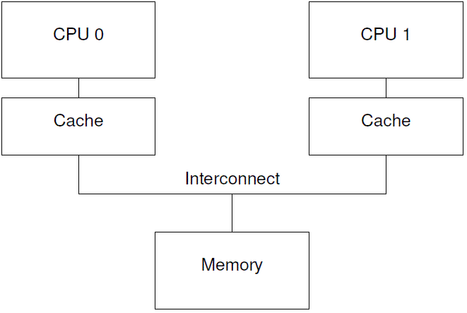
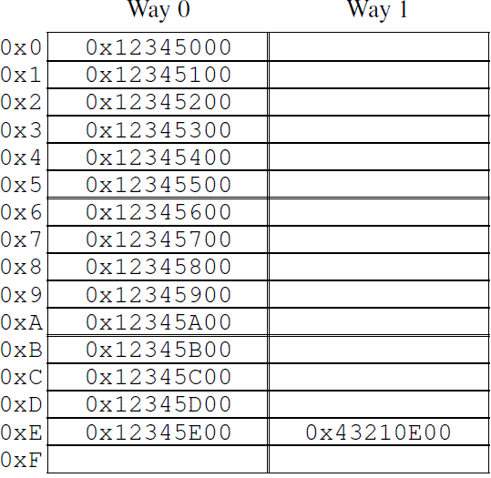
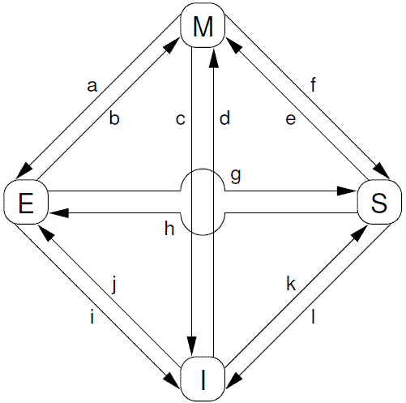
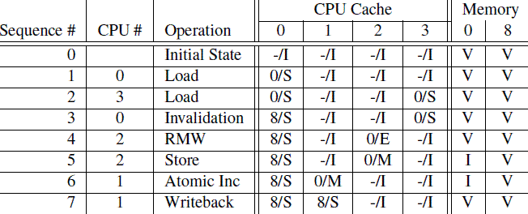
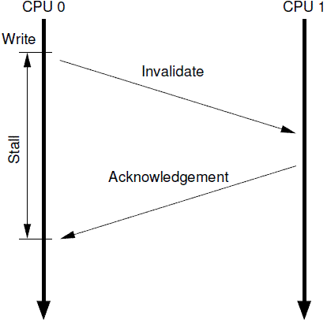
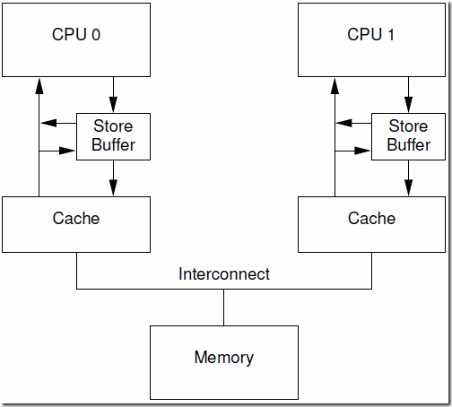
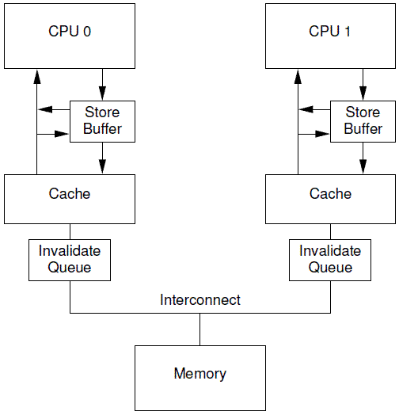
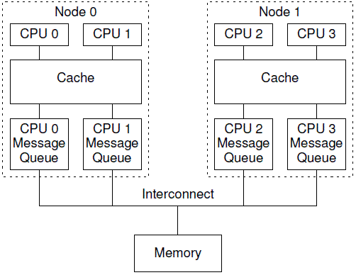

### Why Memory Barriers？

http://www.wowotech.net/kernel_synchronization/Why-Memory-Barriers.html

一、前言

So what possessed CPU designers to cause them to inflict memory barriers on poor unsuspecting SMP software designers?

到底是什么原因导致CPU的设计者把memory barrier这样的大招强加给可怜的，不知情的SMP软件设计者？

In short, because reordering memory references allows much better performance, and so memory barriers are needed to force ordering in things like synchronization primitives whose correct operation depends on ordered memory references.

一言以蔽之，性能，因为对内存访问顺序的重排可以获取更好的性能，如果某些场合下，程序的逻辑正确性需要内存访问顺序和program order一致，例如：同步原语，那么SMP软件工程师可以使用memory barrier这样的工具阻止CPU对内存访问的优化。

Getting a more detailed answer to this question requires a good understanding of how CPU caches work, and especially what is required to make caches really work well. The following sections:

\1. present the structure of a cache,

\2. describe how cache-coherency protocols ensure that CPUs agree on the value of each location in memory, and, finally,

\3. outline how store buffers and invalidate queues help caches and cache-coherency protocols achieve high performance.

如果你想了解更多，需要充分理解CPU cache是如何工作的以及如何让CPU cache更好的工作，本文的主要内容包括：

1、 描述cache的结构

2、 描述cache-coherency protocol如何保证cache一致性

3、 描述store buffers和invalidate queues如何获取更好的性能

We will see that memory barriers are a necessary evil that is required to enable good performance and scalability, an evil that stems from the fact that CPUs are orders of magnitude faster than are both the interconnects between them and the memory they are attempting to access.

在本文中，我们将了解到memory barrier为何是一个必须存在的“邪恶的东西”，一方面，它对性能和扩展性有很大的杀伤力，另外一方面，为了程序的逻辑正确，memory barrier这个“邪恶的东西”必须存在。而之所以会有memory barrier这个“邪恶的东西”是由于CPU的速度要快于（数量级上的差异）memory以及他们之间的互连器件（interconnect）。

 

二、Cache structure

Modern CPUs are much faster than are modern memory systems. A 2006 CPU might be capable of executing ten instructions per nanosecond, but will require many tens of nanoseconds to fetch a data item from main memory. This disparity in speed— more than two orders of magnitude — has resulted in the multi-megabyte caches found on modern CPUs. These caches are associated with the CPUs as shown in Figure C.1, and can typically be accessed in a few cycles.

现代CPU的速度要远快于memory system。一个2006年的CPU可以每ns执行10条指令，但是却需要几十个ns来从main memory中获取数据。这个速度的差异（超过2个数量级）使得现代CPU一般会有几个MB的cache。当然这些cache可以分成若干的level，最靠近CPU那个level的cache可以在一个cycle内完成memory的访问。我们抽象现代计算机系统的cache结构如下：



Data flows among the CPUs’ caches and memory in fixed-length blocks called “cache lines”, which are normally 
a power of two in size, ranging from 16 to 256 bytes. When a given data item is first accessed by a given CPU, it will be absent from that CPU’s cache, meaning that a “cache miss” (or, more specifically, a “startup”or warmup” cache miss) has occurred. The cache miss means that the CPU will have to wait (or be “stalled”) for hundreds of cycles while the item is fetched from memory. However, the item will be loaded into that CPU’s cache, so that subsequent accesses will find it in the cache and therefore run at full speed.

CPU cache和memory系统使用固定大小的数据块来进行交互，这个数据块被称为cache line，cache line的size一般是2的整数次幂，根据设计的不同，从16B到256B不等。当CPU首次访问某个数据的时候，它没有在cpu cache中，我们称之为cache miss（更准确的说法是startup或者warmup cache miss）。在这种情况下，cpu需要花费几百个cycle去把该数据对应的cacheline从memory中加载到cpu cache中，而在这个过程中，cpu只能是等待那个耗时内存操作完成。一旦完成了cpu cache数据的加载，随后的访问会由于数据在cache中而使得cpu全速运行。

After some time, the CPU’s cache will fill, and subsequent misses will likely need to eject an item from the cache in order to make room for the newly fetched item. Such a cache miss is termed a “capacity miss”, because it is caused by the cache’s limited capacity. However, most caches can be forced to eject an old item to make room for a new item even when they are not yet full. This is due to the fact that large caches are implemented as hardware hash tables with fixed-size hash buckets (or “sets”, as CPU designers call them) and no chaining, as shown in 
Figure C.2.

运行一段时间之后，cpu cache的所有cacheline都会被填充有效的数据，这时候的，要加载新的数据到cache中必须将其他原来有效的cache数据“强制驱离”（一般选择最近最少使用的那些cacheline）。这种cache miss被称为capacity miss，因为CPU cache的容量有限，必须为新数据找到空闲的cacheline。有的时候，即便是cache中还有idle的cacheline，旧的cache数据也会被“强制驱离”，以便为新的数据加载到cacheline中做准备。当然，这是和cache的组织有关。size比较大的cache往往实现成hash table（为了硬件性能），所有的cache line被分成了若干个固定大小的hash buckets（更专业的术语叫做set），这些hash buckets之间不是形成链表，而是类似阵列，具体如下图所示：



This cache has sixteen “sets” and two “ways” for a total of 32 “lines”, each entry containing a single 256-byte “cache line”, which is a 256-byte-aligned block of memory. This cache line size is a little on the large size, but makes the hexadecimal arithmetic much simpler. In hardware parlance, this is a two-way set-associative cache, and is analogous to a software hash table with sixteen buckets, where each bucket’s hash chain is limited to at most two elements. The size (32 cache lines in this case) and the associativity (two in this case) are collectively called the cache’s “geometry”. Since this cache is implemented in hardware, the hash function is extremely simple: extract four bits from the memory address.

图中的cache一共有32个cacheline，被组织成16个set，每个set有2个可选的cacheline，分别称之为way 0和way 1。每个cacheline有256个Byte，在cache和memory交互cacheline的时候，要求cache line中数据地址对齐在256个字节上。256B的cacheline size稍显大了一点，主要是为了16进制的算法简单一些，实际中，level 0的cpu cache一般没有这么大。如果用专业术语来说的话，上面的这种cache被称为two-way set-associative cache。这种cache的组织类似软件中的有16个buckets的hash table，每个buckets（注意，这里是复数）中有两个bucket，最多可以放两个数据元素。total cache size（32个cache line）以及associativity（2 way）被称为cache的几何结构。由于是硬件实现，因此hash function（选择哪一个buckets）非常简单：从memory address中选择4个bit即可。

In Figure C.2, each box corresponds to a cache entry, which can contain a 256-byte cache line. However, a cache entry can be empty, as indicated by the empty boxes in the figure. The rest of the boxes are flagged with the memory address of the cache line that they contain. Since the cache lines must be 256-byte aligned, the low eight bits of each address are zero, and the choice of hardware hash function means that the next-higher four bits match the hash line number.

在上图中，每一个cell表示一个cache line，保存256B数据，空的cell表示该cacheline中没有数据，是idle状态的，缓存数据的cacheline标记了其保存数据对应的memory address。由于有256B对齐的要求，因此地址的低8位都是0，而8～11这四个bit用来选择set。

The situation depicted in the figure might arise if the program’s code were located at address 0x43210E00 through 0x43210EFF, and this program accessed data sequentially from 0x12345000 through 0x12345EFF. Suppose that the program were now to access location 0x12345F00. This location hashes to line 0xF, and both ways of this line are empty, so the corresponding 256-byte line can be accommodated. If the program were to access location 0x1233000, which hashes to line 0x0, the corresponding 256-byte cache line can be accommodated in way 1. However, if the program were to access location 0x1233E00, which hashes to line 0xE, one of the existing lines must be ejected from the cache to make room for the new cache line. If this ejected line were accessed later, a cache miss would result. Such a cache miss is termed an “associativity miss”.

当程序顺序访问了0x12345000 到0x12345EFF之间的数据的时候，cache中的前15个set的way 0 cacheline被加载了数据。随后对0x43210E00 到0x43210EFF数据的访问，导致cache的第15个set的way 1 cacheline也被加载的数据。OK，上图中的cache的状态就是这样的。这时候，我们一起看看后续cache的操作情况。如果程序访问0x1233000地址的数据，那么set 0被选中，由于way 0已经是保存了数据，因此way 1被用来缓存本次数据访问的内容。如果程序访问0x12345F00地址的数据，那么set 15被选中，由于way 0和way 1都是idle的，因此way 0被用来缓存本次数据访问的内容。但是，如果访问0x1233E00这个地址开始的256B数据块的时候，问题来了，这时候，set 14（0xE）已经满了，way 0和way 1这两个cacheline都加载了数据，怎么办？当然是把其中之一赶出去，为新来的数据让出地方。如果被赶出去的数据随后又被访问，这时候的cache miss被称为associativity miss。

Thus far, we have been considering only cases where a CPU reads a data item. What happens when it does a write? Because it is important that all CPUs agree on the value of a given data item, before a given CPU writes to that data item, it must first cause it to be removed, or “invalidated”, from other CPUs’ caches. Once this invalidation has completed, the CPU may safely modify the data item. If the data item was present in this CPU’s cache, but was read-only, this process is termed a “write miss”. Once a given CPU has completed invalidating a given data item from other CPUs’ caches, that CPU may repeatedly write (and read) that data item.

到目前为止，我们只考虑了CPU读取数据的情况，如果写入数据会怎样呢？在某个CPU写入数据之前，有一点很重要，即所有的CPU需要对该数据的内容达成共识。因此，A cpu写入之前，需要先将其他cpu cache中的数据设定为无效。只有这个操作完成之后，A cpu才能安全的写入数据，而不会造成一致性的问题。如果该数据已经在A cpu的cache中，但是是read only的，这时候，该cpu不能直接操作cacheline中的对应的数据（因为是read only的），这种cache miss被叫做write miss。一旦A cpu完成了invalidate其他cpu cache中的数据，该cpu可以不断的写或者读取其cache中的数据。（注意：为了表述方便，我这里给指定cpu命名为A）

Later, if one of the other CPUs attempts to access the data item, it will incur a cache miss, this time because the first CPU invalidated the item in order to write to it. This type of cache miss is termed a “communication miss”, since it is usually due to several CPUs using the data items to communicate (for example, a lock is a data item that is used to communicate among CPUs using a mutual-exclusion algorithm).

稍后，如果其他cpu也要访问该数据，由于其他CPU的cache数据已经被设置为无效，因此，其他cpu的访问会导致cache miss。之所以如此，是因为前面A CPU在写入数据的时候，将其他CPU的cache数据设置为无效，这种cache miss被称为communication miss。之所以称为communication miss，是因为这种cache miss的发生是由于多个CPU使用共享内存进行通信（例如：互斥算法中的lock）。

Clearly, much care must be taken to ensure that all CPUs maintain a coherent view of the data. With all this fetching, invalidating, and writing, it is easy to imagine data being lost or (perhaps worse) different CPUs having conflicting values for the same data item in their respective caches. These problems are prevented by “cachecoherency protocols”, described in the next section.

毫无疑问，系统中的各个CPU在进行数据访问的时候有自己的视角（通过自己的cpu cache），因此小心的维持数据的一致性变得非常重要。如果不仔细的进行设计，有可能在各个cpu这对自己特定的CPU cache进行加载cacheline、设置cacheline无效、将数据写入cacheline等动作中，把事情搞糟糕，例如数据丢失，或者更糟糕一些，不同的cpu在各自cache中看到不同的值。这些问题可以通过cachecoherency protocols来保证，也就是下一节的内容。

 

三、cachecoherency protocols

Cache-coherency protocols manage cache-line states so as to prevent inconsistent or lost data. These protocols can be quite complex, with many tens of states, but for our purposes we need only concern ourselves with the four-state MESI cache-coherence protocol.

Cache-coherency协议用来管理cacheline的状态，从而避免数据丢失或者数据一致性问题。这些协议可能非常复杂，定义几十个状态，本节我们只关心MESI cache-coherence 协议中的四个状态。

1、MESI状态

MESI stands for “modified”, “exclusive”, “shared”, and “invalid”, the four states a given cache line can take on using this protocol. Caches using this protocol therefore maintain a two-bit state “tag” on each cache line in addition to that line’s physical address and data.

MESI是“modified”, “exclusive”, “shared”, 和 “invalid”首字母的大写，当使用MESI cache-coherence 协议的时候，cacheline可以处于这四个状态中的一个，因此，HW工程师设计cache的时候，除了物理地址和具体的数据之外，还需要为每一个cacheline设计一个2-bit的tag来标识该cacheline的状态。

A line in the “modified” state has been subject to a recent memory store from the corresponding CPU, and the corresponding memory is guaranteed not to appear in any other CPU’s cache. Cache lines in the “modified”state can thus be said to be “owned” by the CPU. Because this cache holds the only up-to-date copy of the data, this 
cache is ultimately responsible for either writing it back to memory or handing it off to some other cache, and must do so before reusing this line to hold other data.

处于modified状态的cacheline说明近期有过来自对应cpu的写操作，同时也说明该该数据不会存在其他cpu对应的cache中。因此，处于modified状态的cacheline也可以说是被该CPU独占。而又因为只有该CPU的cache保存了最新的数据（最终的memory中都没有更新），所以，该cache需要对该数据负责到底。例如根据请求，该cache将数据及其控制权传递到其他cache中，或者cache需要负责将数据写回到memory中，而这些操作都需要在reuse该cache line之前完成。

The “exclusive” state is very similar to the “modified”state, the single exception being that the cache line has not yet been modified by the corresponding CPU, which in turn means that the copy of the cache line’s data that resides in memory is up-to-date. However, since the CPU can store to this line at any time, without consulting other CPUs, a line in the “exclusive” state can still be said to be owned by the corresponding CPU. That said, because the corresponding value in memory is up to date, this cache can discard this data without writing it back to memory 
or handing it off to some other CPU.

exclusive状态和modified状态非常类似，唯一的区别是对应CPU还没有修改cacheline中的数据，也正因为还没有修改数据，因此memory中对应的data也是最新的。在exclusive状态下，cpu也可以不通知其他CPU cache而直接对cacheline进行操作，因此，exclusive状态也可以被认为是被该CPU独占。由于memory中的数据和cacheline中的数据都是最新的，因此，cpu不需对exclusive状态的cacheline执行写回的操作或者将数据以及归属权转交其他cpu cache，而直接reuse该cacheline（将cacheine中的数据丢弃，用作他用）。

A line in the “shared” state might be replicated in at least one other CPU’s cache, so that this CPU is not permitted to store to the line without first consulting with other CPUs. As with the “exclusive” state, because the 
corresponding value in memory is up to date, this cache can discard this data without writing it back to memory 
or handing it off to some other CPU.

处于share状态的cacheline，其数据可能在一个或者多个CPU cache中，因此，处于这种状态的cache line，CPU不能直接修改cacheline的数据，而是需要首先和其他CPU cache进行沟通。和exclusive状态类似，处于share状态的cacheline对应的memory中的数据也是最新的，因此，cpu也可以直接丢弃cacheline中的数据而不必将其转交给其他CPU cache或者写回到memory中。

A line in the “invalid” state is empty, in other words, it holds no data. When new data enters the cache, it is placed into a cache line that was in the “invalid” state if possible. This approach is preferred because replacing a line in any other state could result in an expensive cache miss should the replaced line be referenced in the future.

处于invalid状态的cacheline是空的，没有数据。当新的数据要进入cache的时候，优选状态是invalid的cacheline，之所以如此是因为如果选中其他状态的cacheline，则说明需要替换cacheline数据，而未来如果再次访问这个被替换掉的cacheline数据的时候将遇到开销非常大的cache miss。

Since all CPUs must maintain a coherent view of the data carried in the cache lines, the cache-coherence protocol 
provides messages that coordinate the movement of cache lines through the system.

由于所有的CPU需要通过其cache看到一致性的数据，因此cache-coherence协议被用来协调cacheline数据在系统中的移动。

2、MESI Protocol Messages

Many of the transitions described in the previous section require communication among the CPUs. If the CPUs are on a single shared bus, the following messages suffice:

在上节中描述的各种状态的迁移需要CPU之间的通信，如果所有CPU都是在一个共享的总线上的时候，下面的message就足够了：

1、Read: The “read” message contains the physical address of the cache line to be read.

1、Read。read message用来获取指定物理地址上的cacheline数据。

2、Read Response: The “read response” message contains the data requested by an earlier “read” message. This “read response” message might be supplied either by memory or by one of the other caches. For example, if one of the caches has the desired data in “modified” state, that cache must supply the “read response” message.

2、Read Response。该消息携带了read message请求的数据。read response可能来自memory，也可能来自其他的cache。例如：如果一个cache有read message请求的数据并且该cacheline的状态是modified，那么该cache必须以read response回应这个read message，因为该cache中保存了最新的数据。

3、Invalidate: The “invalidate” message contains the physical address of the cache line to be invalidated. All other caches must remove the corresponding data from their caches and respond.

3、Invalidate。该命令用来将其他cpu cache中的数据设定为无效。该命令携带物理地址的参数，其他CPU cache在收到该命令后，必须进行匹配，发现自己的cacheline中有该物理地址的数据，那么就将其移除并用Invalidate Acknowledge回应。

4、Invalidate Acknowledge: A CPU receiving an “invalidate”message must respond with an “invalidate acknowledge” message after removing the specified data from its cache.

4、Invalidate Acknowledge。收到invalidate message的cpu cache，在移除了其cache line中的特定数据之后，必须发送invalidate acknowledge消息。

5、Read Invalidate: The “read invalidate” message contains the physical address of the cache line to be read, while at the same time directing other caches to remove the data. Hence, it is a combination of a “read” and an “invalidate”, as indicated by its name. A “read invalidate” message requires both a “read response” and a set of “invalidate acknowledge” messages in reply.

5、Read Invalidate。该message中也包括了物理地址这个参数，以便说明其想要读取哪一个cacheline数据。此外，该message还同时有invalidate message的功效，即其他的cache在收到该命令后，移除自己cacheline中的数据。因此，Read Invalidate message实际上就是read ＋ invalidate。发送Read Invalidate之后，cache期望收到一个read response以及多个invalidate acknowledge。

6、Writeback: The “writeback” message contains both the address and the data to be written back to memory (and perhaps “snooped” into other CPUs’ caches along the way). This message permits caches to eject lines in the “modified” state as needed to make room for other data.

6、Writeback。该message包括两个参数，一个是地址，另外一个是写回的数据。该消息用在modified状态的cacheline被驱逐出境（给其他数据腾出地方）的时候发出，该命名用来将最新的数据写回到memory（或者其他的CPU cache中）。

Interestingly enough, a shared-memory multiprocessor system really is a message-passing computer under the covers. This means that clusters of SMP machines that use distributed shared memory are using message passing 
to implement shared memory at two different levels of the system architecture.

有意思的是基于共享内存的多核系统其底层是基于消息传递的计算机系统。这也就意味着由多个SMP 机器组成的共享内存的cluster系统在两个不同的level上使用了消息传递机制，一个是SMP内部的message passing，另外一个是SMP机器之间的。

3、MESI State Diagram

A given cache line’s state changes as protocol messages are sent and received, as shown in Figure C.3.

根据protocol message的发送和接收情况，cacheline会在“modified”, “exclusive”, “shared”, 和 “invalid”这四个状态之间迁移，具体如下图所示：



The transition arcs in this figure are as follows:

对上图中的状态迁移解释如下：

Transition (a): A cache line is written back to memory, but the CPU retains it in its cache and further retains the right to modify it. This transition requires a “writeback” message.

Transition (a)：cache可以通过writeback transaction将一个cacheline的数据写回到memory中（或者下一级cache中），这时候，该cacheline的状态从Modified迁移到Exclusive状态。对于cpu而言，cacheline中的数据仍然是最新的，而且是该cpu独占的，因此可以不通知其他cpu cache而直接修改之。

Transition (b): The CPU writes to the cache line that it already had exclusive access to. This transition does not require any messages to be sent or received.

Transition (b)：在Exclusive状态下，cpu可以直接将数据写入cacheline，不需要其他操作。相应的，该cacheline状态从Exclusive状态迁移到Modified状态。这个状态迁移过程不涉及bus上的Transaction（即无需MESI Protocol Messages的交互）。

Transition (c): The CPU receives a “read invalidate”message for a cache line that it has modified. The CPU must invalidate its local copy, then respond with both a “read response” and an “invalidate acknowledge” message, both sending the data to the requesting CPU and indicating that it no longer has a local copy.

Transition (c)：CPU 在总线上收到一个read invalidate的请求，同时，该请求是针对一个处于modified状态的cacheline，在这种情况下，CPU必须该cacheline状态设置为无效，并且用read response”和“invalidate acknowledge来回应收到的read invalidate的请求，完成整个bus transaction。一旦完成这个transaction，数据被送往其他cpu cache中，本地的copy已经不存在了。

Transition (d): The CPU does an atomic readmodify-write operation on a data item that was not present in its cache. It transmits a “read invalidate”, receiving the data via a “read response”. The CPU can complete the transition once it has also received a full set of “invalidate acknowledge” responses.

Transition (d)：CPU需要执行一个原子的readmodify-write操作，并且其cache中没有缓存数据，这时候，CPU就会在总线上发送一个read invalidate用来请求数据，同时想独自霸占对该数据的所有权。该CPU的cache可以通过read response获取数据并加载cacheline，同时，为了确保其独占的权利，必须收集所有其他cpu发来的invalidate acknowledge之后（其他cpu没有local copy），完成整个bus transaction。

Transition (e): The CPU does an atomic readmodify-write operation on a data item that was previously read-only in its cache. It must transmit “invalidate” messages, and must wait for a full set of “invalidate acknowledge” responses before completing the transition.

Transition (e)：CPU需要执行一个原子的readmodify-write操作，并且其local cache中有read only的缓存数据（cacheline处于shared状态），这时候，CPU就会在总线上发送一个invalidate请求其他cpu清空自己的local copy，以便完成其独自霸占对该数据的所有权的梦想。同样的，该cpu必须收集所有其他cpu发来的invalidate acknowledge之后，才算完成整个bus transaction。

Transition (f): Some other CPU reads the cache line, and it is supplied from this CPU’s cache, which retains 
a read-only copy, possibly also writing it back to memory. This transition is initiated by the reception of a “read” message, and this CPU responds with a “read response” message containing the requested data.

Transition (f)：在本cpu独自享受独占数据的时候，其他的cpu发起read请求，希望获取数据，这时候，本cpu必须以其local cacheline的数据回应，并以read response回应之前总线上的read请求。这时候，本cpu失去了独占权，该cacheline状态从Modified状态变成shared状态（有可能也会进行写回的动作）。

Transition (g): Some other CPU reads a data item in this cache line, and it is supplied either from this CPU’s cache or from memory. In either case, this CPU retains a read-only copy. This transition is initiated by the reception of a “read” message, and this CPU responds with a “read response” messagecontaining the requested data.

Transition (g)：这个迁移和f类似，只不过开始cacheline的状态是exclusive，cacheline和memory的数据都是最新的，不存在写回的问题。总线上的操作也是在收到read请求之后，以read response回应。

Transition (h): This CPU realizes that it will soon need to write to some data item in this cache line, and thus transmits an “invalidate” message. The CPU cannot complete the transition until it receives a full set of “invalidate acknowledge” responses. Alternatively, all other CPUs eject this cache line from their caches via “writeback” messages (presumably to make room for other cache lines), so that this CPU is the last CPU caching it.

Transition (h)：如果cpu认为自己很快就会启动对处于shared状态的cacheline进行write操作，因此想提前先霸占上该数据。因此，该cpu会发送invalidate敦促其他cpu清空自己的local copy，当收到全部其他cpu的invalidate acknowledge之后，transaction完成，本cpu上对应的cacheline从shared状态切换exclusive状态。还有另外一种方法也可以完成这个状态切换：当所有其他的cpu对其local copy的cacheline进行写回操作，同时将cacheline中的数据设为无效（主要是为了为新的数据腾些地方），这时候，本cpu坐享其成，直接获得了对该数据的独占权。

Transition (i): Some other CPU does an atomic read-modify-write operation on a data item in a cache line held only in this CPU’s cache, so this CPU invalidates it from its cache. This transition is initiated by the reception of a “read invalidate” message, and this CPU responds with both a “read response” and an “invalidate acknowledge” message.

Transition (i)：其他的CPU进行一个原子的read-modify-write操作，但是，数据在本cpu的cacheline中，因此，其他的那个CPU会发送read invalidate，请求对该数据以及独占权。本cpu回送read response”和“invalidate acknowledge”，一方面把数据转移到其他cpu的cache中，另外一方面，清空自己的cacheline。

Transition (j): This CPU does a store to a data item in a cache line that was not in its cache, and thus transmits a “read invalidate” message. The CPU cannot complete the transition until it receives the “read response” and a full set of “invalidate acknowledge” messages. The cache line will presumably transition to “modified” state via transition (b) as soon as the actual store completes.

Transition (j)：cpu想要进行write的操作但是数据不在local cache中，因此，该cpu首先发送了read invalidate启动了一次总线transaction。在收到read response回应拿到数据，并且收集所有其他cpu发来的invalidate acknowledge之后（确保其他cpu没有local copy），完成整个bus transaction。当write操作完成之后，该cacheline的状态会从Exclusive状态迁移到Modified状态。

Transition (k): This CPU loads a data item in a cache line that was not in its cache. The CPU transmits a “read” message, and completes the transition upon receiving the corresponding “read response”.

Transition (k)：本CPU执行读操作，发现local cache没有数据，因此通过read发起一次bus transaction，来自其他的cpu local cache或者memory会通过read response回应，从而将该cacheline从Invalid状态迁移到shared状态。

Transition (l): Some other CPU does a store to a data item in this cache line, but holds this cache line in read-only state due to its being held in other CPUs’ caches (such as the current CPU’s cache). This transition is initiated by the reception of an “invalidate” message, and this CPU responds with an “invalidate acknowledge” message.

Transition (l)：当cacheline处于shared状态的时候，说明在多个cpu的local cache中存在副本，因此，这些cacheline中的数据都是read only的，一旦其中一个cpu想要执行数据写入的动作，必须先通过invalidate获取该数据的独占权，而其他的CPU会以invalidate acknowledge回应，清空数据并将其cacheline从shared状态修改成invalid状态。

4、MESI Protocol Example

Let’s now look at this from the perspective of a cache line’s worth of data, initially residing in memory at address 0, as it travels through the various single-line direct-mapped caches in a four-CPU system. Table C.1 shows this flow of data, with the first column showing the sequence of operations, the second the CPU performing the operation, the third the operation being performed, the next four the state of each CPU’s cache line (memory address followed by MESI state), and the final two columns whether the corresponding memory contents are up to date (“V”) or not (“I”).

OK，在理解了各种cacheline状态、各种MESI协议消息以及状态迁移的描述之后，我们从cache line数据的角度来看看MESI协议是如何运作的。开始，数据保存在memory的0地址中，随后，该数据会穿行在四个CPU的local cache中。为了方便起见，我们让CPU local cache使用最简单的Direct-mapped的组织形式。具体的过程可以参考下面的图片：



第一列是操作序列号，第二列是执行操作的CPU，第三列是具体执行哪一种操作，第四列描述了各个cpu local cache中的cacheline的状态（用meory address/状态表示），最后一列描述了内存在0地址和8地址的数据内容的状态：V表示是最新的，和cache一致，I表示不是最新的内容，最新的内容保存在cache中。

Initially, the CPU cache lines in which the data would reside are in the “invalid” state, and the data is valid in memory. When CPU 0 loads the data at address 0, it enters the “shared” state in CPU 0’s cache, and is still 
valid in memory. CPU 3 also loads the data at address 0, so that it is in the “shared” state in both CPUs’ caches, and is still valid in memory. Next CPU 0 loads some other cache line (at address 8), which forces the data at 
address 0 out of its cache via an invalidation, replacing it with the data at address 8. CPU 2 now does a load from address 0, but this CPU realizes that it will soon need to store to it, and so it uses a “read invalidate” message in order to gain an exclusive copy, invalidating it from CPU 3’s cache (though the copy in memory remains up to 
date). Next CPU 2 does its anticipated store, changing the state to “modified”. The copy of the data in memory is 
now out of date. CPU 1 does an atomic increment, using a “read invalidate” to snoop the data from CPU 2’s cache and invalidate it, so that the copy in CPU 1’s cache is in the “modified” state (and the copy in memory remains out of date). Finally, CPU 1 reads the cache line at address 8, which uses a “writeback” message to push address 0’s data back out to memory.

最开始的时候（sequence 0），各个cpu cache中的cacheline都是Invalid状态，而Memory中的数据都保存了最新的数据。随后（sequence 1），CPU 0执行了load操作，将address 0的数据加载到寄存器，这个操作使得保存0地址数据的那个cacheline从invalid状态迁移到shared状态。随后（sequence 2），CPU3也对0地址执行了load操作，导致其local cache上对应的cacheline也切换到shared状态。当然，这时候，memory仍然是最新的。在sequence 3中，CPU 0执行了对地址8的load操作，由于地址0和地址8都是选择同一个cache set，而且，我们之前已经说过，该cache是direct-mapped的（即每个set只有一个cacheline），因此需要首先清空该cacheline中的数据（该操作被称为Invalidation），由于cacheline的状态是shared，因此，不需要通知其他CPU。Invalidation local cache上的cacheline之后，cpu 0的load操作将该cacheline状态修改成Shared状态（保存地址8的数据）。CPU 2也开始执行load操作了（sequence 4），虽然是load操作，但是CPU知道程序随后会修改该值（不是原子操作的read-modify-write，否就是迁移到Modified状态了，也不是单纯的load操作，否则会迁移到shared状态），因此向总线发送了read invalidate命令，一方面获取该数据（自己的local cache中没有地址0的数据），另外，CPU 2想独占该数据（因为随后要write）。这个操作导致CPU 3的cacheline迁移到invalid状态。当然，这时候，memory仍然是最新的有效数据。CPU 2的store操作很快到来（Sequence 5），由于准备工作做的比较充分（Exclusive状态，独占该数据），cpu直接修改cacheline中的数据（对应地址0），从而将其状态迁移到modified状态，同时要注意的是：memory中的数据已经失效，不是最新的数据了，任何其他CPU发起对地址0的load操作都不能从memory中读取，而是通过嗅探（snoop）的方式从CPU 2的local cache中获取。在sequence 6中，CPU 1对地址0的数据执行原子的加1操作，这时候CPU 1会发出read invalidate命令，将地址0的数据从CPU 2的cacheline中嗅探得到，同时通过invalidate其他CPU local cache的内容而获得独占性的数据访问权。这时候，CPU 2中的cacheline状态变成invalid状态，而CPU 1将从invalid状态迁移到modified状态。最后（sequence 7），CPU 1对地址8进行load操作，由于cacheline被地址0占据，因此需要首先将其驱逐出cache，于是执行write back操作将地址0的数据写回到memory，同时发送read命名，从CPU 0的cache中获得数据加载其cacheline，最后，CPU1的cache变成shared状态（保存地址8的数据）。由于执行了write back操作，memory中地址0的数据又变成最新的有效数据了。

 

四、Stores Result in Unnecessary Stalls

Although the cache structure shown in Figure C.1 provides good performance for repeated reads and writes from a given CPU to a given item of data, its performance for the first write to a given cache line is quite poor. To see this, consider Figure C.4, which shows a timeline of a write by CPU 0 to a cacheline held in CPU 1’s cache. Since CPU 0 must wait for the cache line to arrive before it can write to it, CPU 0 must stall for an extended period of time.

在上面的现代计算机cache结构图，我们可以看出，针对某些特定地址的数据（在一个cacheline中）重复的进行读写，这种结构可以获得很好的性能，不过，对于第一次写，其性能非常差。下面的这个图可以展示为何写性能差：



cpu 0发起一次对某个地址的写操作，但是local cache没有数据，该数据在CPU 1的local cache中，因此，为了完成写操作，CPU 0发出invalidate的命令，invalidate其他CPU的cache数据。只有完成了这些总线上的transaction之后，CPU 0才能正在发起写的操作，这是一个漫长的等待过程。

But there is no real reason to force CPU 0 to stall for so long — after all, regardless of what data happens to be in the cache line that CPU 1 sends it, CPU 0 is going to unconditionally overwrite it.

但是，其实没必要等待这么长的时间，毕竟，物理CPU 1中的cacheline保存有什么样子的数据，其实都没有意义，这个值都会被CPU 0新写入的值覆盖的。

1、Store Buffers

One way to prevent this unnecessary stalling of writes is to add “store buffers” between each CPU and its cache, 
as shown in Figure C.5. With the addition of these store buffers, CPU 0 can simply record its write in its store buffer and continue executing. When the cache line does finally make its way from CPU 1 to CPU 0, the data will be moved from the store buffer to the cache line.

有一种可以阻止cpu进入无聊等待状态的方法就是在CPU和cache之间增加store buffer这个HW block，如下图所示：


一旦增加了store buffer，那么cpu0无需等待其他CPU的相应，只需要将要修改的内容放入store buffer，然后继续执行就OK了。当cacheline完成了bus transaction，并更新了cacheline的状态后，要修改的数据将从store buffer进入cacheline。

These store buffers are local to a given CPU or, on systems with hardware multithreading, local to a given core. Either way, a given CPU is permitted to access only the store buffer assigned to it. For example, in Figure C.5, CPU 0 cannot access CPU 1’s store buffer and vice versa. This restriction simplifies the hardware by separating concerns: The store buffer improves performance for consecutive writes, while the responsibility for communicating among CPUs (or cores, as the case may be) is fully shouldered by the cache-coherence protocol. However, even given this restriction, there are complications that must be addressed, which are covered in the next two sections.

这些store buffer对于cpu而言是local的，如果系统是硬件多线程， 那么每一个cpu core拥有自己私有的stroe buffer，一个cpu只能访问自己私有的那个store buffer。在上图中，cpu 0不能访问cpu1的store buffer，反之亦然。之所以做这样的限制是为了模块划分（各个cpu core模块关心自己的事情，让cache系统维护自己的操作），让硬件设计变得简单一些。store buffer增加了CPU连续写的性能，同时把各个CPU之间的通信的任务交给维护cache一致性的协议。即便给每个CPU分配私有的store buffer，仍然引入了一些复杂性，我们会在下面两个小节中描述。

2、Store Forwarding

To see the first complication, a violation of selfconsistency, consider the following code with variables “a” and “b” both initially zero, and with the cache line containing variable “a” initially owned by CPU 1 and that containing “b” initially owned by CPU 0:

上文提到store buffer引入了复杂性，我们先看第一个例子：本地数据不一致的问题。我们先看看下面的代码：

```c
a = 1;
b = a + 1;
assert( b == 2 );
```

a和b都是初始化为0，并且变量a在CPU 1的cacheline中，变量b在CPU 0的cacheline中。

One would not expect the assertion to fail. However, if one were foolish enough to use the very simple architecture 
shown in Figure C.5, one would be surprised. Such a system could potentially see the following sequence of events:

如果cpu执行上述代码，那么第三行的assert不应该失败，不过，如果CPU设计者使用上图中的那个非常简单的store buffer结构，那么你应该会遇到“惊喜”（assert失败了）。具体的执行过程是这样的：

（1） CPU 0 starts executing the a = 1. CPU 0执行a=1的赋值操作

（2） CPU 0 looks “a” up in the cache, and finds that it is missing. CPU 0遇到cache miss

（3） CPU 0 therefore sends a “read invalidate” message in order to get exclusive ownership of the cache line containing “a”. CPU 0发送read invalidate消息以便从CPU 1那里获得数据，并invalid其他cpu保存a数据的local cacheline。

（4）CPU 0 records the store to “a” in its store buffer. CPU 0把要写入的数据“1”放入store buffer

（5）CPU 1 receives the “read invalidate” message, and responds by transmitting the cache line and removing that cacheline from its cache. CPU 1收到read invalidate后回应，把本地cacheline的数据发送给CPU 0并清空本地cache中a的数据

（6） CPU 0 starts executing the b = a + 1. CPU 0执行b = a + 1

（7）CPU 0 receives the cache line from CPU 1, which still has a value of zero for “a”. CPU 0 收到来自CPU 1的数据，该数据是“0”

（8）CPU 0 loads “a” from its cache, finding the value zero. CPU 0从cacheline中加载a，获得0值

（9）CPU 0 applies the entry from its store buffer to the newly arrived cache line, setting the value of “a” in its cache to one. CPU 0将store buffer中的值写入cacheline，这时候cache中的a值是“1”

（10）CPU 0 adds one to the value zero loaded for “a”above, and stores it into the cache line containing “b”(which we will assume is already owned by CPU 0). CPU 0执行a＋1，得到1并将该值写入b

（11）CPU 0 executes assert(b == 2), which fails. OMG，你期望b等于2，但是实际上b等于了1

The problem is that we have two copies of “a”, one in the cache and the other in the store buffer.

导致这个问题的根本原因是我们有两个a值，一个在cacheline中，一个在store buffer中。

This example breaks a very important guarantee, namely that each CPU will always see its own operations 
as if they happened in program order. Breaking this guarantee is violently counter-intuitive to software types, so much so that the hardware guys took pity and implemented “store forwarding”, where each CPU refers to (or “snoops”) its store buffer as well as its cache when performing loads, as shown in Figure C.6. In other words, a given CPU’s stores are directly forwarded to its subsequent loads, without having to pass through the cache.

上面这个出错的例子之所以发生是因为它违背了一个基本的原则，即每个CPU按照其视角来观察自己的行为的时候必须是符合program order的。一旦违背这个原则，会导致一些非常不直观的软件行为，对软件工程师而言就是灾难。还好，有”好心“的硬件工程师帮助我们，修改了CPU的设计如下：



这种设计叫做store forwarding，当CPU执行load操作的时候，不但要看cache，还有看store buffer是否有内容，如果store buffer有该数据，那么就采用store buffer中的值。因此，即便是store操作还没有写入cacheline，store forwarding的效果看起来就好象cpu的store操作被向前传递了一样（后面的load的指令可以感知到这个store操作） 。

With store forwarding in place, item 8 in the above sequence would have found the correct value of 1 for “a”in the store buffer, so that the final value of “b” would have been 2, as one would hope.

有了store forwarding的设计，上面的步骤（8）中就可以在store buffer获取正确的a值是”1“而不是”0“，因此计算得到的b的结果就是2，和我们预期的一致了。

3、Store Buffers and Memory Barriers

To see the second complication, a violation of global memory ordering, consider the following code sequences with variables “a” and “b” initially zero:

关于store buffer引入的复杂性，我们再来看看第二个例子：

```c
void foo(void) { 
	a = 1; 
	b = 1; 
} 

void bar(void)  { 
	while (b == 0) continue; 
	assert(a == 1); 
}
```

同样的，a和b都是初始化成0.

Suppose CPU 0 executes foo() and CPU 1 executes bar(). Suppose further that the cache line containing “a” resides only in CPU 1’s cache, and that the cache line containing “b” is owned by CPU 0. Then the sequence of operations might be as follows:

我们假设CPU 0执行foo函数，CPU 1执行bar函数。我们再进一步假设a变量在CPU 1的cache中，b在CPU 0 cache中，执行的操作序列如下：

（1）CPU 0 executes a = 1. The cache line is not in CPU 0’s cache, so CPU 0 places the new value of “a” in its store buffer and transmits a “read invalidate”message. CPU 0执行a=1的赋值操作，由于a不在local cache中，因此，CPU 0将a值放到store buffer中之后，发送了read invalidate命令到总线上去。

（2） CPU 1 executes while (b == 0) continue, but the cache line containing “b” is not in its cache. It therefore transmits a “read” message. CPU 1执行 while (b == 0) 循环，由于b不在CPU 1的cache中，因此，CPU发送一个read message到总线上，看看是否可以从其他cpu的local cache中或者memory中获取数据

（3） CPU 0 executes b = 1. It already owns this cache line (in other words, the cache line is already in either the “modified” or the “exclusive” state), so it stores the new value of “b” in its cache line. CPU 0继续执行b=1的赋值语句，由于b就在自己的local cache中（cacheline处于modified状态或者exclusive状态），因此CPU0可以直接操作将新的值1写入cache line。

（4） CPU 0 receives the “read” message, and transmits the cache line containing the now-updated value of “b” to CPU 1, also marking the line as “shared” in its own cache. CPU 0收到了read message，将最新的b值”1“回送给CPU 1，同时将b cacheline的状态设定为shared

（5） CPU 1 receives the cache line containing “b” and installs it in its cache. CPU 1收到了来自CPU 0的read response消息，将b变量的最新值”1“值写入自己的cacheline，状态修改为shared。

（6） CPU 1 can now finish executing while (b == 0) continue, and since it finds that the value of “b” is 1, it proceeds to the next statement. 由于b值等于1了，因此CPU 1跳出while (b == 0)的循环，继续前行。

（7） CPU 1 executes the assert(a == 1), and, since CPU 1 is working with the old value of “a”, this 
assertion fails. CPU 1执行assert(a == 1)，这时候CPU 1的local cache中还是旧的a值，因此assert(a == 1)失败。

（8） CPU 1 receives the “read invalidate” message, and transmits the cache line containing “a” to CPU 0 and invalidates this cache line from its own cache. But it is too late. CPU 1收到了来自CPU 0的read invalidate消息，以a变量的值进行回应，同时清空自己的cacheline，但是这已经太晚了。

（9） CPU 0 receives the cache line containing “a” and applies the buffered store just in time to fall victim to CPU 1’s failed assertion. CPU 0收到了read response和invalidate ack的消息之后，将store buffer中的a的最新值”1“数据写入cacheline，然并卵，CPU 1已经assertion fail了。

The hardware designers cannot help directly here, since the CPUs have no idea which variables are related, let alone how they might be related. Therefore, the hardware designers provide memory-barrier instructions to allow the software to tell the CPU about such relations. The program fragment must be updated to contain the memory barrier:

遇到这样的问题，CPU设计者也不能直接帮什么忙，毕竟CPU并不知道哪些变量有相关性，这些变量是如何相关的。不过CPU设计者可以间接提供一些工具让软件工程师来控制这些相关性。这些工具就是memory-barrier指令。要想程序正常运行，必须增加一些memory barrier的操作，具体如下：

```c
void foo(void) { 
	a = 1; 
	smb_mb();
	b = 1; 
} 

void bar(void)  { 
	while (b == 0) continue; 
	assert(a == 1); 
}
```

The memory barrier smp_mb() will cause the CPU to flush its store buffer before applying each subsequent store to its variable’s cache line. The CPU could either simply stall until the store buffer was empty before proceeding, or it could use the store buffer to hold subsequent stores until all of the prior entries in the store buffer had been applied. 
With this latter approach the sequence of operations might be as follows:

smp_mb() 这个内存屏障的操作会在执行后续的store操作之前，首先flush store buffer（也就是将之前的值写入到cacheline中）。smp_mb() 操作主要是为了让数据在local cache中的操作顺序是符合program order的顺序的，为了达到这个目标有两种方法：方法一就是让CPU stall，直到完成了清空了store buffer（也就是把store buffer中的数据写入cacheline了）。方法二是让CPU可以继续运行，不过需要在store buffer中做些文章，也就是要记录store buffer中数据的顺序，在将store buffer的数据更新到cacheline的操作中，严格按照顺序执行，即便是后来的store buffer数据对应的cacheline已经ready，也不能执行操作，要等前面的store buffer值写到cacheline之后才操作。增加smp_mb() 之后，操作顺序如下：

（1）CPU 0 executes a = 1. The cache line is not in CPU 0’s cache, so CPU 0 places the new value of “a” in its store buffer and transmits a “read invalidate”message. CPU 0执行a=1的赋值操作，由于a不在local cache中，因此，CPU 0将a值放到store buffer中之后，发送了read invalidate命令到总线上去。

（2） CPU 1 executes while (b == 0) continue, but the cache line containing “b” is not in its cache. It therefore transmits a “read” message. CPU 1执行 while (b == 0) 循环，由于b不在CPU 1的cache中，因此，CPU发送一个read message到总线上，看看是否可以从其他cpu的local cache中或者memory中获取数据

（3） CPU 0 executes smp_mb(), and marks all current store-buffer entries (namely, the a = 1).  CPU 0执行smp_mb()函数，给目前store buffer中的所有项做一个标记（后面我们称之marked entries）。当然，针对我们这个例子，store buffer中只有一个marked entry就是“a=1”。

（4） CPU 0 executes b = 1. It already owns this cache line (in other words, the cache line is already in either the “modified” or the “exclusive” state), but there is a marked entry in the store buffer. Therefore, rather than store the new value of “b” in the cache line, it instead places it in the store buffer (but in an unmarked entry). CPU 0继续执行b=1的赋值语句，虽然b就在自己的local cache中（cacheline处于modified状态或者exclusive状态），不过在store buffer中有marked entry，因此CPU0并没有直接操作将新的值1写入cache line，取而代之是b的新值”1“被写入store buffer，当然是unmarked状态。

（5）CPU 0 receives the “read” message, and transmits the cache line containing the original value of “b” to 
CPU 1. It also marks its own copy of this cache line as “shared”. CPU 0收到了read message，将b值”0“（新值”1“还在store buffer中）回送给CPU 1，同时将b cacheline的状态设定为shared。

（6） CPU 1 receives the cache line containing “b” and installs it in its cache. CPU 1收到了来自CPU 0的read response消息，将b变量的值（”0“）写入自己的cacheline，状态修改为shared。

（7） CPU 1 can now load the value of “b”, but since it finds that the value of “b” is still 0, it repeats the 
while statement. The new value of “b” is safely hidden in CPU 0’s store buffer.  完成了bus transaction之后，CPU 1可以load b到寄存器中了（local cacheline中已经有b值了），当然，这时候b仍然等于0，因此循环不断的loop。虽然b值在CPU 0上已经赋值等于1，但是那个新值被安全的隐藏在CPU 0的store buffer中。

（8） CPU 1 receives the “read invalidate” message, and transmits the cache line containing “a” to CPU 0 and  invalidates this cache line from its own cache. CPU 1收到了来自CPU 0的read invalidate消息，以a变量的值进行回应，同时清空自己的cacheline。

（9） CPU 0 receives the cache line containing “a” and applies the buffered store, placing this line into the “modified” state. CPU 0将store buffer中的a值写入cacheline，并且将cacheline状态修改为modified状态。

（10） Since the store to “a” was the only entry in the store buffer that was marked by the smp_mb(), CPU 0 can also store the new value of “b” — except for the fact that the cache line containing “b” is now in “shared” state. 由于store buffer只有一项marked entry（对应a=1），因此，完成step 9之后，store buffer的b也可以进入cacheline了。不过需要注意的是，当前b对应的cacheline的状态是shared。

（11） CPU 0 therefore sends an “invalidate” message to CPU 1. CPU 0发送invalidate消息，请求b数据的独占权

（12） CPU 1 receives the “invalidate” message, invalidates the cache line containing “b” from its cache, and 
sends an “acknowledgement” message to CPU 0. CPU 1收到invalidate消息，清空自己的b cacheline，并回送acknowledgement给CPU 0。

（13） CPU 1 executes while (b == 0) continue, but the cache line containing “b” is not in its cache. It therefore transmits a “read” message to CPU 0. CPU 1继续执行while (b == 0)，由于b不在自己的local cache中，因此 CPU 1发送read消息，请求获取b的数据。

（14） CPU 0 receives the “acknowledgement” message, and puts the cache line containing “b” into the “exclusive” state. CPU 0 now stores the new value of “b” into the cache line. CPU 0收到acknowledgement消息，将b对应的cacheline修改成exclusive状态，这时候，CPU 0终于可以将b的新值1写入cacheline。

（15） CPU 0 receives the “read” message, and transmits the cache line containing the new value of “b” to CPU 1. It also marks its own copy of this cache line as “shared”. CPU 0收到read消息，将b的新值1回送给CPU 1，同时将其local cache中b对应的cacheline状态修改为shared。

（16） CPU 1 receives the cache line containing “b” and installs it in its cache.  CPU 1获取来自CPU 0的b的新值，将其放入cacheline中

（17） CPU 1 can now load the value of “b”, and since it finds that the value of “b” is 1, it exits the while loop and proceeds to the next statement. 由于b值等于1了，因此CPU 1跳出while (b == 0)的循环，继续前行。

（18） CPU 1 executes the assert(a == 1), but the cache line containing “a” is no longer in its cache. Once it gets this cache from CPU 0, it will be working with the up-to-date value of “a”, and the assertion therefore passes. CPU 1执行assert(a == 1)，不过这时候a值没有在自己的cacheline中，因此需要通过cache一致性协议从CPU 0那里获得，这时候获取的是a的最新值，也就是1值，因此assert成功。

As you can see, this process involves no small amount of bookkeeping. Even something intuitively simple, like“load the value of a” can involve lots of complex steps in silicon.

通过上面的描述，我们可以看到，一个直观上很简单的给a变量赋值的操作，都需要那么长的执行过程，而且每一步都需要芯片参与，最终完成整个复杂的赋值操作过程。

 

五、Store Sequences Result in Unnecessary Stalls

Unfortunately, each store buffer must be relatively small, which means that a CPU executing a modest sequence of stores can fill its store buffer (for example, if all of them result in cache misses). At that point, the CPU must once again wait for invalidations to complete in order to drain its store buffer before it can continue executing. This same situation can arise immediately after a memory barrier, when all subsequent store instructions must wait for invalidations to complete, regardless of whether or not these stores result in cache misses.

不幸的是：每个cpu的store buffer不能实现的太大，其entry的数目不会太多。当cpu以中等的频率执行store操作的时候（假设所有的store操作导致了cache miss），store buffer会很快的被填满。在这种状况下，CPU只能又进入等待状态，直到cache line完成invalidation和ack的交互之后，可以将store buffer的entry写入cacheline，从而为新的store让出空间之后，CPU才可以继续执行。这种状况也可能发生在调用了memory barrier指令之后，因为一旦store buffer中的某个entry被标记了，那么随后的store都必须等待invalidation完成，因此不管是否cache miss，这些store都必须进入store buffer。

This situation can be improved by making invalidate acknowledge messages arrive more quickly. One way of accomplishing this is to use per-CPU queues of invalidate messages, or “invalidate queues”.

引入invalidate queues可以缓解这个状况。store buffer之所以很容易被填充满，主要是其他CPU回应invalidate acknowledge比较慢，如果能够加快这个过程，让store buffer尽快进入cacheline，那么也就不会那么容易填满了。

1、Invalidate Queues

One reason that invalidate acknowledge messages can take so long is that they must ensure that the corresponding 
cache line is actually invalidated, and this invalidation can be delayed if the cache is busy, for example, if the CPU is intensively loading and storing data, all of which resides in the cache. In addition, if a large number of invalidate messages arrive in a short time period, a given CPU might fall behind in processing them, thus possibly stalling all the other CPUs.

invalidate acknowledge不能尽快回复的主要原因是invalidate cacheline的操作没有那么快完成，特别是cache比较繁忙的时候，这时，CPU往往进行密集的loading和storing的操作，而来自其他CPU的，对本CPU local cacheline的操作需要和本CPU的密集的cache操作进行竞争，只要完成了invalidate操作之后，本CPU才会发生invalidate acknowledge。此外，如果短时间内收到大量的invalidate消息，CPU有可能跟不上处理，从而导致其他CPU不断的等待。

However, the CPU need not actually invalidate the cache line before sending the acknowledgement. It could instead queue the invalidate message with the understanding that the message will be processed before the CPU sends any further messages regarding that cache line.

然而，CPU其实不需要完成invalidate操作就可以回送acknowledgement消息，这样，就不会阻止发生invalidate请求的那个CPU进入无聊的等待状态。CPU可以buffer这些invalidate message（放入Invalidate Queues），然后直接回应acknowledgement，表示自己已经收到请求，随后会慢慢处理。当然，再慢也要有一个度，例如对a变量cacheline的invalidate处理必须在该CPU发送任何关于a变量对应cacheline的操作到bus之前完成。

2、Invalidate Queues and Invalidate Acknowledge

Figure C.7 shows a system with invalidate queues. A CPU with an invalidate queue may acknowledge an invalidate message as soon as it is placed in the queue, instead of having to wait until the corresponding line is actually invalidated. Of course, the CPU must refer to its invalidate queue when preparing to transmit invalidation messages—if an entry for the corresponding cache line is in the invalidate queue, the CPU cannot immediately transmit the invalidate message; it must instead wait until the invalidate-queue entry has been processed.

有invalidate queue的系统结构如下图所示：



有了Invalidate Queue的CPU，在收到invalidate消息的时候首先把它放入Invalidate Queue，同时立刻回送acknowledge 消息，无需等到该cacheline被真正invalidate之后再回应。当然，如果本CPU想要针对某个cacheline向总线发送invalidate消息的时候，那么CPU必须首先去Invalidate Queue中看看是否有相关的cacheline，如果有，那么不能立刻发送，需要等到Invalidate Queue中的cacheline被处理完之后再发送。

Placing an entry into the invalidate queue is essentially a promise by the CPU to process that entry before transmitting any MESI protocol messages regarding that cache line. As long as the corresponding data structures are not highly contended, the CPU will rarely be inconvenienced by such a promise.

一旦将一个invalidate（例如针对变量a的cacheline）消息放入CPU的Invalidate Queue，实际上该CPU就等于作出这样的承诺：在处理完该invalidate消息之前，不会发送任何相关（即针对变量a的cacheline）的MESI协议消息。只要是对该cacheline的竞争不是那么剧烈，CPU还是对这样的承诺很有信心的。

However, the fact that invalidate messages can be buffered in the invalidate queue provides additional opportunity for memory-misordering, as discussed in the next section.

然而，缓存了invalidate消息也会引入一些其他的memory order的问题，我们在下一节讨论。

3、Invalidate Queues and Memory Barriers

Let us suppose that CPUs queue invalidation requests, but respond to them immediately. This approach minimizes the cache-invalidation latency seen by CPUs doing stores, but can defeat memory barriers, as seen in the following 
example.

我们假设CPU缓存invalidation消息，在操作cacheline之前直接回应该invalidation消息。这样的机制对于发送invalidation的CPU侧是非常好的事，该CPU的store性能会非常高，但是会使内存屏障指令失效，我们来看看下面的例子：

```c
void foo(void) { 
	a = 1; 
	smb_mb();
	b = 1; 
} 

void bar(void)  { 
	while (b == 0) continue; 
	assert(a == 1); 
}
```

Suppose the values of “a” and “b” are initially zero, that “a” is replicated read-only (MESI “shared” state), and that “b” is owned by CPU 0 (MESI “exclusive” or “modified” state). Then suppose that CPU 0 executes foo() while CPU 1 executes function bar() in the following code fragment:

在上面的代码片段中，我们假设a和b初值是0，并且a在CPU 0和CPU 1都有缓存的副本，即a变量对应的CPU0和CPU 1的cacheline都是shared状态。b处于exclusive或者modified状态，被CPU 0独占。我们假设CPU 0执行foo函数，CPU 1执行bar函数。

Then the sequence of operations might be as follows:

具体的操作序列如下：

（1） CPU 0 executes a = 1. The corresponding cache line is read-only in CPU 0’s cache, so CPU 0 places 
the new value of “a” in its store buffer and transmits an “invalidate” message in order to flush the corresponding cache line from CPU 1’s cache. CPU 0执行a=1的赋值操作，由于a在CPU 0 local cache中的cacheline处于shared状态，因此，CPU 0将a的新值“1”放入store buffer，并且发送了invalidate消息去清空CPU 1对应的cacheline。

（2） CPU 1 executes while (b == 0) continue, but the cache line containing “b” is not in its cache. It therefore transmits a “read” message.CPU 1执行while (b == 0)的循环操作，但是b没有在local cache，因此发送read消息试图获取该值。

（3） CPU 1 receives CPU 0’s “invalidate” message, queues it, and immediately responds to it. CPU 1收到了CPU 0的invalidate消息，放入Invalidate Queue，并立刻回送Ack。

（4） CPU 0 receives the response from CPU 1, and is therefore free to proceed past the smp_mb() on line 4 above, moving the value of “a” from its store buffer to its cache line. CPU 0收到了CPU 1的invalidate ACK之后，即可以越过程序设定内存屏障（第四行代码的smp_mb() ），这样a的新值从store buffer进入cacheline，状态变成Modified。

（5） CPU 0 executes b = 1. It already owns this cache line (in other words, the cache line is already in either the “modified” or the “exclusive” state), so it stores the new value of “b” in its cache line. CPU 0 越过memory barrier后继续执行b=1的赋值操作，由于b值在CPU 0的local cache中，因此store操作完成并进入cache line。

（6） CPU 0 receives the “read” message, and transmits the cache line containing the now-updated value of “b” to CPU 1, also marking the line as “shared” in its own cache. CPU 0收到了read消息后将b的最新值“1”回送给CPU 1，并修正该cacheline为shared状态。

（7） CPU 1 receives the cache line containing “b” and installs it in its cache. CPU 1收到read response，将b的最新值“1”加载到local cacheline。

（8） CPU 1 can now finish executing while (b == 0) continue, and since it finds that the value of “b” is 1, it proceeds to the next statement. 对于CPU 1而言，b已经等于1了，因此跳出while (b == 0)的循环，继续执行后续代码

（9） CPU 1 executes the assert(a == 1), and, since the old value of “a” is still in CPU 1’s cache, this 
assertion fails. CPU 1执行assert(a == 1)，但是由于这时候CPU 1 cache的a值仍然是旧值0，因此assertion 失败

（10） Despite the assertion failure, CPU 1 processes the queued “invalidate” message, and (tardily) invalidates 
the cache line containing “a” from its own cache. 该来总会来，Invalidate Queue中针对a cacheline的invalidate消息最终会被CPU 1执行，将a设定为无效，但素，大错已经酿成。

There is clearly not much point in accelerating invalidation responses if doing so causes memory barriers to effectively be ignored. However, the memory-barrier instructions can interact with the invalidate queue, so that when a given CPU executes a memory barrier, it marks all the entries currently in its invalidate queue, and forces any subsequent load to wait until all marked entries have been applied to the CPU’s cache. Therefore, we can add 
a memory barrier to function bar as follows:

很明显，在上文中的场景中，加速Invalidation response导致foo函数中的memory barrier失效了，因此，这时候对Invalidation response已经没有意义了，毕竟程序逻辑都错了。怎么办？其实我们可以让memory barrier指令和Invalidate Queue进行交互来保证确定的memory order。具体做法是这样的：当CPU执行memory barrier指令的时候，对当前Invalidate Queue中的所有的entry进行标注，这些被标注的项次被称为marked entries，而随后CPU执行的任何的load操作都需要等到Invalidate Queue中所有marked entries完成对cacheline的操作之后才能进行。因此，要想保证程序逻辑正确，我们需要给bar函数增加内存屏障的操作，具体如下：

```c
void foo(void) { 
	a = 1; 
	smb_mb();
	b = 1; 
} 

void bar(void)  { 
	while (b == 0) continue; 
	smb_mb();
	assert(a == 1); 
}
```

With this change, the sequence of operations might be as follows:

程序修改之后，我们再来看看CPU的执行序列：

（1） CPU 0 executes a = 1. The corresponding cache line is read-only in CPU 0’s cache, so CPU 0 places 
the new value of “a” in its store buffer and transmits an “invalidate” message in order to flush the corresponding cache line from CPU 1’s cache. CPU 0执行a=1的赋值操作，由于a在CPU 0 local cache中的cacheline处于shared状态（read only），因此，CPU 0将a的新值“1”放入store buffer，并且发送了invalidate消息去清空CPU 1对应的cacheline。

（2） CPU 1 executes while (b == 0) continue,  but the cache line containing “b” is not in its cache. It therefore transmits a “read” message. CPU 1执行while (b == 0)的循环操作，但是b没有在local cache，因此发送read消息试图获取该值。

（3） CPU 1 receives CPU 0’s “invalidate” message, queues it, and immediately responds to it. CPU 1收到了CPU 0的invalidate消息，放入Invalidate Queue，并立刻回送Ack。

（4） CPU 0 receives the response from CPU 1, and is therefore free to proceed past the smp_mb() on line 4 above, moving the value of “a” from its store buffer to its cache line. CPU 0收到了CPU 1的invalidate ACK之后，即可以越过程序设定内存屏障（第四行代码的smp_mb() ），这样a的新值从store buffer进入cacheline，状态变成Modified。

（5） CPU 0 executes b = 1. It already owns this cache line (in other words, the cache line is already in either the “modified” or the “exclusive” state), so it stores the new value of “b” in its cache line. CPU 0 越过memory barrier后继续执行b=1的赋值操作（这时候该cacheline或者处于modified状态，或者处于exclusive状态），由于b值在CPU 0的local cache中，因此store操作完成并进入cache line。

（6） CPU 0 receives the “read” message, and transmits the cache line containing the now-updated value of “b” to CPU 1, also marking the line as “shared” in its own cache. CPU 0收到了read消息后将b的最新值“1”回送给CPU 1，并修正该cacheline为shared状态。

（7） CPU 1 receives the cache line containing “b” and installs it in its cache. CPU 1收到read response，将b的最新值“1”加载到local cacheline。

（8） CPU 1 can now finish executing while (b == 0) continue, and since it finds that the value of “b” is 1, it proceeds to the next statement, which is now a memory barrier. 对于CPU 1而言，b已经等于1了，因此跳出while (b == 0)的循环，继续执行memory barrier的代码。

（9） CPU 1 must now stall until it processes all preexisting messages in its invalidation queue. CPU 1现在不能继续执行代码，只能等待，直到Invalidate Queue中的message被处理完成

（10） CPU 1 now processes the queued “invalidate” message,  and invalidates the cache line containing “a” from its own cache. CPU 1处理队列中缓存的Invalidate消息，将a对应的cacheline设置为无效。

（11） CPU 1 executes the assert(a == 1), and, since the cache line containing “a” is no longer in CPU 1’s cache, it transmits a “read” message.  由于a变量在local cache中无效，因此CPU 1在执行assert(a == 1)的时候需要发送一个read消息去获取a值。

（12） CPU 0 responds to this “read” message with the cache line containing the new value of “a”.  CPU 0用a的新值1回应来自CPU 1的请求。

（13） CPU 1 receives this cache line, which contains a value of 1 for “a”, so that the assertion does not trigger. CPU 1获得了a的新值，并放入cacheline，这时候assert(a == 1)不会失败了。

With much passing of MESI messages, the CPUs arrive at the correct answer. This section illustrates why CPU designers must be extremely careful with their cachecoherence optimizations.

虽然多了很多MESI协议的交互，但是最终CPU的执行符合了预期的结果。这一节也说明了为什么CPU designer一定会非常小心的处理cache一致性的问题。

 

六、Read and Write Memory Barriers

In the previous section, memory barriers were used to mark entries in both the store buffer and the invalidate queue. But in our code fragment, foo() had no reason to do anything with the invalidate queue, and bar() similarly had no reason to do anything with the store buffer.

在我们上面的例子中，memory barrier指令对store buffer和invalidate queue都进行了标注，不过，在实际的代码片段中，foo函数不需要mark invalidate queue，bar函数不需要mark store buffer

Many CPU architectures therefore provide weaker memory-barrier instructions that do only one or the other of these two. Roughly speaking, a “read memory barrier” marks only the invalidate queue and a “write memory barrier” marks only the store buffer, while a full-fledged memory barrier does both.

因此，许多CPU architecture提供了弱一点的memory barrier指令只mark其中之一。如果只mark invalidate queue，那么这种memory barrier被称为read memory barrier。相应的，write memory barrier只mark store buffer。一个全功能的memory barrier会同时mark store buffer和invalidate queue。

The effect of this is that a read memory barrier orders only loads on the CPU that executes it, so that all loads preceding the read memory barrier will appear to have completed before any load following the read memory barrier. Similarly, a write memory barrier orders only stores, again on the CPU that executes it, and again so that all stores preceding the write memory barrier will appear to have completed before any store following the write memory barrier. A full-fledged memory barrier orders both loads and stores, but again only on the CPU executing the memory barrier.

我们一起来看看读写内存屏障的执行效果：对于read memory barrier指令，它只是约束执行CPU上的load操作的顺序，具体的效果就是CPU一定是完成read memory barrier之前的load操作之后，才开始执行read memory barrier之后的load操作。read memory barrier指令象一道栅栏，严格区分了之前和之后的load操作。同样的，write memory barrier指令，它只是约束执行CPU上的store操作的顺序，具体的效果就是CPU一定是完成write memory barrier之前的store操作之后，才开始执行write memory barrier之后的store操作。全功能的memory barrier会同时约束load和store操作，当然只是对执行memory barrier的CPU有效。

If we update foo and bar to use read and write memory barriers, they appear as follows:

现在，我们可以改一个用读写内存屏障的版本了，具体如下：

```c
void foo(void) { 
	a = 1; 
	smb_wmb();
	b = 1; 
} 

void bar(void)  { 
	while (b == 0) continue; 
	smb_rmb();
	assert(a == 1); 
}
```

Some computers have even more flavors of memory barriers, but understanding these three variants will provide a good introduction to memory barriers in general.

有些CPU有更多种类的memory barrier操作，不过read mb，write mb和全功能的mb是应用普遍的指令，理解了这三个之后再学习其他的就比较简单了。

七、Example Memory-Barrier Sequences

This section presents some seductive but subtly broken uses of memory barriers. Although many of them will work most of the time, and some will work all the time on some specific CPUs, these uses must be avoided if the goal is to produce code that works reliably on all CPUs. To help us better see the subtle breakage, we first need to focus on an ordering-hostile architecture.

这一小节我们会分析几个有意思的memory barrier的例子。尽管这些代码大部分时间都可以正常工作，并且其中有些在某些特定平台的CPU上可以一直正常工作，但是，如果我们的目标是星辰大海（平台无关代码，即在所有的CPU上都可以正确运行），那么还是有必要看看这些微妙的错误是如何发生的。我们先来看看ordering-hostile architecture这个概念。

1、Ordering-Hostile Architecture

A number of ordering-hostile computer systems have been produced over the decades, but the nature of the hostility has always been extremely subtle, and understanding it has required detailed knowledge of the specific hardware. Rather than picking on a specific hardware vendor, and as a presumably attractive alternative to dragging the reader through detailed technical specifications, let us instead design a mythical but maximally memory-ordering-hostile 
computer architecture.

在过去的数十年里，许多ordering-hostile的计算系统被生产出来，对于这类计算机系统，memory order非常精妙，需要大量的硬件知识才能理解它。与其选择一个特定的硬件平台，把读者带入特定的一些技术细节，不如做点看起来更有意思的事情：我们自己设计一个对memory order约束最弱的CPU architecture。

This hardware must obey the following ordering constraints [McK05a, McK05b]:

这种硬件必须服从下面的规则：

（1） Each CPU will always perceive its own memory accesses as occurring in program order. 对于每个CPU而言，从它自己的角度看，其内存访问的顺序总是符合program order的。

（2） CPUs will reorder a given operation with a store only if the two operations are referencing different locations. 如果CPU要对一个指定的操作（load或者store）和另外的一个store操作进行重排的话，那么一定要符合指定的条件：即这两个操作的memory地址是不能有重叠区域的。

（3） All of a given CPU’s loads preceding a read memory barrier (smp_rmb()) will be perceived by all CPUs to precede any loads following that read memory barrier. 如果program order是先load A然后load B，这样的操作在CPU 0上执行的时候，从其自己来看memory系统的变化，当然是load A，然后load B（请参考前面的第一条规则）。但是，系统中的其他其他CPU如何看待CPU 0的操作呢（想像所有的CPU都是趴在总线上的观察者，不断的观察memory的变化）？根据前面文章描述的知识，可以肯定的是load A和load B的顺序是无法保证的。如果增加了个read memory barrier，那结果可就不一样了。假设CPU 0执行的是load A，然后read memory barrier，最后load B，那么总线上的所有CPU，包括CPU 0自己，看到的内存操作顺序都是load A，然后load B。

（4） All of a given CPU’s stores preceding a write memory barrier (smp_wmb()) will be perceived by all CPUs to precede any stores following that write memory barrier. 如果系统中所有的CPU都是潜伏在总线上的观察者，不断的观察memory的变化。那么任意一个给定的系统中的CPU在执行store代码的时候，都可以被系统中的所有CPU感知（包括它自己）。如果给定CPU执行的代码被write memory barrier分成两段：wmb之前的store操作，wmb之后的store操作，那么系统中所有的CPU的观察结果都是一样的，wmb之前的store操作先执行完毕，wmb之后的store操作随后被执行。

（5） All of a given CPU’s accesses (loads and stores) preceding a full memory barrier (smp_mb()) will be perceived by all CPUs to precede any accesses following that memory barrier.某一个CPU执行的全功能内存屏障指令之前的memory access的操作（load or store），必定先被系统中所有的CPU感知到，之后系统中的所有CPU才看到全功能内存屏障指令之后的memory access的操作（load or store）的执行结果。

Imagine a large non-uniform cache architecture (NUCA) system that, in order to provide fair allocation of interconnect bandwidth to CPUs in a given node, provided per-CPU queues in each node’s interconnect interface, as shown in Figure C.8. Although a given CPU’s accesses are ordered as specified by memory barriers executed by that CPU, however, the relative order of a given pair of CPUs’ accesses could be severely reordered, as we will see.

一个示例性的Ordering-Hostile Architecture如下图所示：



这个系统被称为non-uniform cache architecture (NUCA) 的系统，为了公平的分配Interconnect到各个CPU之间的带宽，我们在Node和interconnect器件之间的接口设计了per cpu的Message queue。尽管，一个指定CPU的内存访问可以通过memory barrier对访问顺序进行约定，但是，一对CPU上的内存访问可以被完全打乱重排，下面我们会详细描述。

2、Example 1

Table C.2 shows three code fragments, executed concurrently by CPUs 0, 1, and 2. Each of “a”, “b”, and “c” are initially zero.

下表列出了CPU 0、CPU 1和CPU 2各自执行的代码片段，a，b，c变量的初始值都是0。


文章地址http://www.wowotech.net/kernel_synchronization/why-memory-barrier-2.html