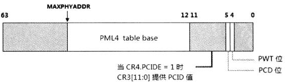

# x86_x64体系探索及编程

### 二进制数的排序：

**MSB和LSB**：

在日常的书写表达上，最左边的位是最高位。数的位排列从左到右，对应的值从高到低。在机器的数字电路上，数的高低位可以从左到右进行排列，也可以从右到左进行排列。

以一个自然的二进制表达序列上32位的二进制数为例，最右边是bit 0,最左边是bit 31,。那么bit 0就用LSB（Least Significant Bit，最低有效位）来表示，bit 31就用MSB（Most Significant Bit，最高有效位）来表示。

**系统段寄存器**：GDTR，LDTR，IDTR（中断描述符表寄存器），以及TR（任务寄存器）。使用在系统编程里，是保护模式编程里重要的系统数据资源。

**系统段寄存器操作数是隐式提供的，没有明确的字面助记符**

LGDT [GTD_BASE]	;从内存[GTD_BASE]处加载GDT的base和limit值到GDTR，隐式提供目的操作数为GDTR。

x86体系中还有更多隐式寄存器，MSR（Model Specific Register）能提供对处理器更多的配置和管理。每个MSR寄存器有相应的编址。在ecx寄存器里放入 MSR的地址，由rdmsr指令进行读取，wdmsr指令进行写。

​	mov ecx, 1bh ;	APIC_BASE寄存器地址

​	rdmsr		；	读入APIC_BASE寄存器的64位值到eda:eax

​	mov ecx, c0000080h ; EFER地址

​	rdmsr		；	读入EFER原值

​	bts eax, 8	; EFER.LME = 1

​	wdmsr		; 	开启long mode

**I/O端口寻址**

​	x86/64体系实现了独立的64K I/O地址空间（从0000H到FFFFH），IN和OUT指令用来访问这个I/O地址。

​	in指令读取外部端口数据，out指令往外部端口写数据。<u>（<!--何为外部端口？I/O端口？-->）</u>

​		in al, 20H	;	从端口20H里读取一个byte

​	in和out指令是CPU和外部接口进行通信的工具。许多设备的底层驱动还是要靠in/out指令。端口的寻址是通过immediate形式，还可以通过DX寄存器提供port值。immediate只能提供8位的port值，在x86上提供了64K范围的port，访问0xff以上的port必须使用DX寄存器提供。

​	在x86/64体系中device（设备）还可以使用memory I/O（I/O内存映射）方式映射到物理地址空间，典型的如VGA设备的buffer被映射到物理地址中。

**cpuid**

​	从486处理器开始，加入cpuid指令。eflags寄存器的bit 21是ID（Processor Feature Identification）标志位。修改eflags寄存器的bit 21标志位，如果能修改成功，就表示支持cpuid指令。

leaf（叶）

​	功能号使用leaf术语，例如：CPUID的01号功能，你可以称其为CPUID的01 leaf（叶）。

sub-leaf（子叶）

​	对于一些较复杂的信息查询，往往需要一个辅助的子号。EAX寄存器输入的是main leaf，ECX寄存器提供的是sub-leaf。

​		mov eax, 0Bh; 		//main leaf

​		mov ecx, 0;			//sub-leaf

​		cpuid

​	如上所示，0B号功能就是main leaf，ECX提供的0号就是sub-leaf。

CPUID指令的描述形式

​	当软件需要判断某项功能处理器是否支持时，使用CPUID指令进行查询，在Intel手册中使用了下面的描述形式。

​					

​	上面是判断处理器是否支持PAE（Physical Address Extensions）功能时的描述，当CPUID.01H:EDX[6]的值为1时，表示支持PAE功能。

基本信息与扩展信息

​	从CPUID指令获得的信息有两大类：base和extended，要获得信息必须要先提供相应的leaf，每一类信息都有最大的功能号限制。

​	某些功能号下面还有许多sub-leaf，也就是信息的子集。使用CPUID指令之前在eax寄存器提供需要查询的某个信息相应的功能号。

​		mov eax， 0			//功能号0

​		cpuid

​	返回的相应信息放在eax、ebx、ecx、edx寄存器中。这些信息是32位的，因此在64位模式下，rax、rbx、rcx、rdx寄存器的高32位被清0。

查询最大的leaf号

​	CPUID指令被使用来查询处理器所支持的特性，因此在使用CPUID所支持的leaf数量是与处理器相关的。很多时候，在使用某个leaf之前，必须判断处理器是否支持该leaf。

基本最大功能号

​	使用CPUID的00Hleaf来查询，最大的基本功能号返回在EAX寄存器里。

​		mov eax，0  	//功能号0

​		cpuid		

​		cmp eax，0BH   //判断是否支持0B leaf

​		jb  no_support //假如不支持。

扩展最大功能号

​	最大扩展功能号也可以查询。

​		mov eax，80000000 //功能号80000000（main leaf）

​		cpuid				//查询最大扩展功能号

​		cmp eax， 80000001H   //判断是否支持8000001H leaf

​	**如果在eax中输入的功能号超过了最大的功能号，那么将返回basic最大功能号的信息。**

​	**当输入的功能号<=最大功能号时，如果CPU并不支持该功能号，则所有寄存器返回0值，eax=ebx=ecx=edx=0。**

处理器扩展状态信息

​	0Dh功能号是获得处理器对Processor Extended State（处理器扩展状态）的支持度，这在AVX指令编程里非常重要。

​	0Dh功能号是一个功能集，在前面的例子中：

​		mov eax，0Dh ；		//0Dh功能号

​		mov ecx，0	；		//main leaf功能

​		cpuid；				//得到0Dh的main leaf功能

​	这个main leaf功能就可以获得CPU目前对处理器状态的支持度。eax和edx寄存器返回processor extended state的enable/disable位图。

​	这个Processor Extended State值将影响到XCR0（Extended Control Register）的值。当State值得某位为0时，那么XCR0相应的位为保留位（此位不能被XSETBV指令设置）。

**Eflags**

​	在eflags寄存器里可以分为status flags（状态标志位）、control flags（控制标志位）和system flags（系统标志位）

​	control flags只有一个DF（Direction Flags）标志位（bit10），它使用在LODSx，STOSx，MOVSx，SCASx，OUTSx，以及INSx这类串指令，指示串指令的指针方向。

​	DF标志所表达的意思是（以movsb指令为例）在一个循环里：

​	`if (eflags.DF == 0)`

`​	{`

`​		buffer[edi++] == source[esi++]		/* 指针edi和esi都是递增 */`

`​	}else if (eflags.DF == 1)`

`​	{`

`​		buffer[edi--] = source[esi--]		/* 指针edi和esi都是递减 */`

`​	}`

​	在递增情况下，源串和目标串指针应该指向起始点；在递减的情况下，源串和目标串指针应该执行终点。这是软件设计者的职责。

*Eflags中的状态标志位*

​	status flags包括：OF（溢出标志），SF（符号位标志），ZF（零标志），AF（调整位标志），CF（进位标志），以及PF（奇偶位标志）。这些标志位反映了指令执行结果的状态值。

*PF标志*

​	指令判断结果值得最低字节（byte 0），而设置相应的PF标志位，如下所示：

​			1100 0001 <u>1010 0011</u> 		//最低字节1的数量是偶数，则eflags.DF = 1

*AF标志*

​	当运算时bit 3发生向上进位或借位是，AF标志被设置。AF标志位使用在BCD码的运算指令上，如下面使用AF标志位的例子。

​		mov al，8			；al = 0000 1000B

​		mov bl，9			;   bl = 0000 1001B

​		add al，bl			；al = 0001 0001B，AF标志为1

​		aaa					；使用AF标志进行调整，AX的结果是：00000001 00000111B

​	在上面的8+9式子里，bit 3向bit 4进1位。AAA指令根据AF标志进行调整后，AX的值变成0107H（BCD码形式）

*signed数的运算*

​	status flags中ZF标志位可以用在signed和unsigned数上。

​	signed数运算中使用的标志位有：OF（溢出）标志和SF（符号）标志。

​	对于signed数溢出，有两种情况：

​	① overflow（向上溢出）：当结果值超出signed数的最大值时产生overflow

​	② underflow（向下溢出）：当结果值超出signed数的最小值时产生underflow。

​	当结果产生overflow或者underflow时会对OF标志位置位。

​	**两个正数相加，结果为负数时，产生了overflow溢出。**

​	**两个负数相加，结果为正数，产生了underflow溢出**。

​	**正数和负数相加，不会产生溢出。**

***signed数的比较操作***

​	OF、SF以及ZF标志都用于signed数的比较。在执行cmp指令比较时，是对两个数进行相减操作，将比较的结果反映在标志位上。

​	**当OF == SF时，比较结果是大于。**

​	**当OF <> SF 时，比较结果是小于。**

***signed数的条件码***

​	基于SF标志、OF标志，以及ZF标志位，下面是用于signed数的条件码。

​		G（greater）		；OF == SF，并且 ZF = 0

​		L（less）		；OF <> SF

​		GE（greater or equal）	； OF == SF

​		LE（less or equal）		；OF <> SF 或者 ZF = 1

​	在GE（大于等于）的情况下只需判断OF是否等于SF标志，无论ZF是否为零都满足条件。而在L（小于）的情况下只需判断OF不等于SF标志就可以了，也不需要判断ZF标志。

***unsigned数的运算***

​	ZF标志和CF标志被用在与unsigned数相关运算里，在unsigned数的相关比较中不会使用OF和SF这两个标志位。

​	在相加运算中，由于向前进位而使用CF标志置位。在相减运算中，由于向前借位也会使CF标志置位。

***unsigned数的比较及条件码***

​	当unsigned数相减时，如果不够减则会产生借位（eflags.CF=1）,表明是小于关系。

​		A（Above）					；CF = 0并且ZF = 0

​		B（Below）					；CF = 1

​		AE（Above or equal）			；CF = 0

​		BE（Below or equal）			；CF = 1或者ZF = 1

​	AE和B的比较中都无需判断ZF标志。

***IOPL标志位***

​	eflags有两个位来表示IOPL（I/O Privilege Level）标志位，**指示访问I/O地址空间所需要的权限**，这个值仅在CPL=0权限下可以修改。IOPL标志还将影响到IF标志位，IF标志位在具有IOPL所规定的权限内能被修改。

​	只有当CPL=0时，可以改变IOPL的值，当CPL<=IOPL时，可以改变IF标志位。

​	改变IOPL值可以使用popfd指令和iret指令，IF标志位还有专门的指令开/关中断：sti和cli指令。当使用popfd指令进行修改时，没有足够的权限时不能修改其值，但是并不会产生异常。

​	修改过程大致：

​		pushfd			；get eflags

​		or DWORD [esp], 0x3000		;将IOPL = 3

​		popfd						；modify the IOPL

***I/O Bitmap***

​	~~IOPL控制着程序的I/O地址空间访问权，只有在足够的权限下才能访问I/O地址，否则会产生#GP异常。这句话说的不太完整，还与I/O位图有关。~~

​	如果当前CPL>IOPL（值大于），在TSS段中的I/O Bitmap有最后的决定权。

​	即使当前运行的权限低于IOPL所规定的权限，也可以在TSS中的I/O Bitmap对某些port进行设置，达到可以访问I/O地址空间。当CPL>IOPL时，对port的I/O访问处理器将检查I/O Bitmap中相应的port位以决定这个I/O访问是否违例，当CPL<=IOPL时则无需检查I/O Bitmap（CPL数值越小，则权限越大）。

​	I/O Bitmap中的每个bit对应于一个port，当这个bit被置位时（设置为1），程序对port无访问权限。当这个bit被清0时，port是可以访问的。

****

**TF标志与RF标志***

​	显然eflags.RF标志与eflags.TF标志是配合一起使用的，放TF标志被置位时，就代表开启了single-debug（单步调试）功能，处理器 将进入single-debug状态。

​	当TF标志被置位，执行下一条指令后，处理器进入#DB处理。这是因为single-debug属于trap类型的#DB异常。

​	实例：

​		；开启single debug功能

​			`pushfd`

​			`bts dword [esp], 8				;eflags.TF=1`

​			`popfd					;更新eflags寄存器`

​			`mov eax，1					；test 1`

​			`mov eax，2					；test 2`

​			`mov eax，3					；test 3`

​			`mov eax，4					；test 4`

​			`mov eax，5					；test 5`

​	popfd指令执行完后，将更新TF标志为1，那么应该是在test 1之前还是之后产生#DB异常？答案是在test 1之后（test 2）之前，是在TF被置位后的下一条指令执行完成后产生#DB异常。

​	**处理器在进入#DB异常处理程序之前，会将TF标志清0以防止在中断处理程序内发生single-debug**，这是显而易见的事情，RF标志也会被清0。在进入中断处理程序前，NT和VM标志都会得到清0。

​	那么，在压入单步调试#DB处理程序stack内的eflags寄存器中TF是原来的值（即为1），RF标志被清0。<!--此处应该区分清被调试程序的栈和中断处理程序的栈，在中断处理程序中，eflags的TF标志位肯定要为0，因为为1时，中断处理程序也要进行single debug模式，这肯定不是我们想要的，但是中断处理程序的栈中eflags.TF为1,是因为中断处理程序返回时弹出eflags，回到被调试的程序时，被调试的程序eflags.TF应该为1。-->

​	如上图，当popf指令执行完毕后，TF被置1，第一条mov指令执行完毕，产生#DB异常，cpu进入#DB处理程序后清TF和RF标志，而在#DB处理程序里，在iret指令返回钱，应该将stack中的RF标志置为1，以确保返回到被中断的指令时能顺利执行。itet指令将pop回stack中原来的eflags值。

​	当第2条指令执行完毕后，CPU将清RF标志为0，处理器重新转入到#DB处理程序中执行。除非TF标志被清0，否则重复上一流程。

​	由于引发#DB异常的不止single-debug这一途径。#DB异常可以是Fault类型或是Trap类型，因此，在#DB异常处理程序中有责任去确保返回被中断的执行能够得到正常执行。通过设置stack中的eflags映像中的RF为1，让iret返回前更新eflags寄存器。

​	处理器会在每一条指令执行完毕后将RF标志清0，RF标志的值基本上恒为0。

****

**NT标志***

​	NT标志被使用于处理器提供的task switch（任务切换）场景中，它是Nested Task（嵌套任务）标志位，当NT=1时，表示当前执行的任务被嵌套在另一个任务里（这是从任务的术语上来讲），当NT=0时，当前执行的任务没有被嵌套。<u>NT标志一般由处理器自动维护，但是可以在任何权限下被软件修改。</u>

​	在使用call指令进行task switch，以及发生interrupt/exception时的task switch，处理器从new task的TSS加载完eflags寄存器后，会将NT设置为1。

​	<!-- 这个情景中的task switch是指：call调用一个TSS selector或者task-gate，以及interrupt/exception发生时，vector指向IDT中的task-gate -->

​	使用jmp一个TSS selector或者task-gate也会产生任务切换，iret指令也可以产生任务切换，但它们不在上述将NT设置为1的情景中。

​	在上述的task switch情景中，处理器会同时将旧任务的TSS selector写入到新任务TSS段中的previous-link域中，以便可以切回到旧任务。

​	*NT标志位清0*

​	其中一个情景是：当使用iret指令从被嵌套的任务（new）返回到原来的（old）任务时，处理器从stack中pop出eflags寄存器后会清NT为0（实际上是，先将stack中eflags寄存器image中的NT位清0，然后pop的时候，NT标志就为0）。

​	当执行iret指令时，处理器会检查当前的eflags.NT标志是否为1，为1时表示处于nested状态，执行完成后NT被清为0。

​	<!-- 这个情景中的返回是指：使用iret指令从interrupt/exception处理程序中返回时。注意：使用ret指令从一个过程的返回并不在其中 -->

​	当执行ret指令时，并不会清NT标志位（不改变stack中eflags寄存器image中的NT标志位，pop的时候NT标志位0），它并不需要去检查 NT标志位是否为1值。

​	另一个情景是：使用jmp进行task切换时，处理器从新任务的TSS加载eflags完后，会将NT标志清为0，表示JMP指令执行的并不是嵌套任务。

​	在软件中可以由程序员手动去修改NT标志的值，通过修改在stack中的eflags寄存器image的NT标志位，然后使用popf指令进行更新。

​	**在long mode下的64位模式下并不支持TSS的task switch机制，因此，在64位模式下NT标志位是无效的**

****

**AC标志**

​	eflags中的AC标志是指Alignment Check（地址中的对齐检查），只有当同时开启CR0.AM和eflags.AC标志位时处理器才支持这项功能。

------

**VM标志**

​	eflags中的VM标志指示着处理器进入和离开virtrual-8086模式，当VM=1时进入virtual-8086模式，当VM=0时离开virtrual-8086模式，VM标志不能被popfd指令修改，只有两种途径可以设置eflags.VM标志位。

1.  执行一个task switch（任务切换）时，包括：使用call/jmp指令执行一个TSS selector或者task-gate，在TSS段中的eflags寄存器image中VM被置1，处理器加载eflags时，VM为1,从而进入virtual-8086模式；当执行iret指令时，stack中的eflags.NF表示将进入任务切换，如果TSS段中的eflags.VM为1，也指示处理器进入virtual-8086模式。

2. 当执行iret指令时，stack中的eflags镜像VM为1，也将指示处理器进入virtual-8086模式。

​	只有执行iret指令，stack中的eflags镜像VM标志为0时，才会离开virtual-8086模式，执行call/jmp进行任务切换（TSS段中的eflags.VM=0）这种情况并不能离开virtual-8086模式。

​	在64位模式下，处理器不支持virtual-8086模式，VM标志位也被忽略。

------

**eflags寄存器的其他事项**

​	处理器初始化后，eflags的值为00000002H，Bit 1为1，其他位为0，Bit 1是保留值，其值固定为1。某些标志位可以使用专门指令进行设置，对于CF标志，可以使用STC指令置位，CLC指令清位，CMC指令对CF标志位进行取反。对于DF标志，可以使用STD指令进行置位，CLD指令清位。

​	STI指令可以对IF标志进行置位，CLI指令可以对IF标志位进行清位，它需要足够的权限来修改IF标志位，这个足够的权限是：CPL<=IOPL。

​	可是这和popfd指令修改IF标志位不同，当不够权限（CPL > IOPL），popfd指令修改IF标志位不会产生#GP异常，而使用STI指令时会产生#GP异常。

------

## 处理器的控制寄存器

​	在x64上control register（控制寄存器）被扩展为64位，有CR0 ~ CR15共16个寄存器，可是在整个体系的使用中，只使用了其中的CR0、CR2、CR3、CR4以及CR8寄存器，其他都是保留的。它们在64位模式下使用64位的宽度，在其他模式下依然是32位宽度，下面是这些寄存器的结构图：

​	CR0与CR4结合起来对处理器提供了根本的控制，比如处理器的工作模式和一些模式中使用的特色功能。

​	CR2和CR3被使用在保护模式的页管理机制中。CR2保存着访内存是引发#PF异常的线性地址值（典型的如：当访问一个页时，它不在内存中（未映射）或者没有对它进行访问的权限而引发的#PF异常）。CR3提供整个页转换结构表的基地址，这个基地址是物理地址。

------

**CR8**

​	CR8又被称为Task Priority Register（任务优先级寄存器），它在64位模式下才有效。它的结构如下所示。

​			

​	CR8的低4位（bit 3到bit 0）提供了一个Priority level值，这个值为0 ~ 15，将控制处理器可以响应的中断级别，这个中断属于maskable（可屏蔽的）硬件中断。如果这个值被设置为0，则可以响应所有的中断，如果设置为15则处理器不会响应所有的中断。

**中断优先级别**

​	在x86/x64体系里中断向量为0 ~ 255（1 byte），因此使用了16个中断优先级别（0~15），这个优先级别的计算如下：

​			Priority level = vector/16

​	软件不能是使用0 ~ 15最为硬件中断vector值，否则会产生错误，它们是保留给系统使用的。所以实际优先级只使用了1 ~ 15（对应中断vector 16 ~ 255）。然而使用16 ~ 31向量号虽然不会产生错误，但是不推荐使用（它们也是保留给系统使用）。

​	CR8在初始化时为0值，除了向量号从0到15是不可用外，可以响应所有的中断。如果设置CR8的值为1，将抑制16 ~ 31的中断向量。

​	又如当设CR8[3:0]为1000B时，priority level的值为8，处理器将对优先级等于或低于8的中断进行阻断，只响应优先级别大于8的中断。

​	CR8是local APIC的TPR（task priority register）对外的编程接口，它们的值和作用是一样的。对CR8进行更改会影响到local APIC的TPR，写入CR8[3:0]的值会同时写入TPR[7:4]中，TPR[7:4]的值就等于CR8[3:0]的值。

------

**CR3**

​	PAE：Physical Address Extension（物理地址扩展）

​	CR3被指向第一级的页转换表结构，它指向的页表结构因使用的分页模式而不同。

​	① 在使用non-PAE模式下的分页结构时，是指向Page-Directory Table的基地址。

​	② 在使用PAE模式下的分页结构时，是指向Page-Directory-Pointer Table的基地址。

​	③ 在long mode下，是指向Page-Map Leve-4 Table的基地址。

​	因此，在这些模式之下，CR3的内容也有不同。

​	

​	上图是32-bit paging中的CR3结构，CR3[31:12]提供PDT的物理基地址的高20位，而PDT地址的低12为0。因此CR3提供的PDT是4K边界对齐的。CR3[3]是PWT（Page-leve write-through）位，CR3[4]是PCD（Page-level cache disable）位。

​	在PAE模式下，分页转换结构被扩展为64位结构，CR3结构如下所示。

​	

​	在这个CR3结构里，CR[4:0]是忽略的，并没有PWT和PCD标志位，CR3[31:5]提供32为PDPT（PDPT：Page Directory Pointer Table）的物理结构基地址的高27位，PDPT地址的低5位为0，因此这个PDPT是32字节对齐的。

​	

​	上图是处理器在long mode之下的CR3结构，如果处理器支持52位物理地址，那么CR3[51:12]提供PML4（Page-Map Level-4 Table）表基地址的高40位。如果处理器支持40位的物理地址，那么CR3[39:12]提供高28位。否则只支持36位物理地址，CR3[35:12]提供高24位。PML4表基地址的低12位是0，因此PML4表是4K边界对齐的。

​	MAXPHYADDR的值从CPUID.EAX=8000008H leaf里查询，返回的EAX[7:4]就是MAXPHYADDR的值。

​	x64处理器体系中目前最高支持52位的物理地址，由处理器的实现决定。在Intel的处理器中支持CR4.PCIDE标志位，在AMD的机器中并不支持，因此，CR3[11:0]在AMD的机器中是不支持PCID值的。在支持PCID功能的Intel64机器中，只有当CR3[11:0]为0时，CR4.PCIDE才被置位，否则会产生#GP异常。

​	当执行mov cr3, reg指令后，处理器内的TLB将被强制刷新。除非在页面被设置为Global属性。

​	未完待续：关于CR3更详细的信息，参考第11章中关于paging机制的相关介绍。

------

**CR0**

​	CR0里面有许多重要的控制位，其中最重要的一个是PE控制位，它决定着处理器处于保护模式还是实模式。

*CR0.PE*

​	处理器在初始化后，CR0.PE=0则处于实模式状态。当置CR0.PE=1时，表示处理器处于保护模式状态下，处理器将按照保护模式下的行为进行运作。为处理器提供保护模式的执行环境，这是系统软件的职责。处理器只负责按照保护模式的规则运行。

​	

​	